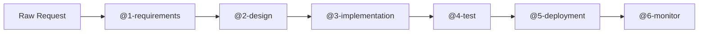

# Agentic Build Pipeline for Enterprise Software Development

A reusable framework that orchestrates six specialized GitHub Copilot agent roles
to take a raw feature request through requirements, design, implementation,
testing, deployment, and monitoring — all governed by enterprise standards.

## The Concept

Rather than six independent AI agents, this pipeline is six **specialized roles**
that GitHub Copilot steps into at each stage of the software development
lifecycle. The power comes from:

1. **Role specialization** — each `.github/agents/<role>.agent.md` gives the model
   focused instructions, inputs, and output formats for one stage
2. **Artifact chaining** — each stage's output is the next stage's input,
   creating a traceable, reviewable audit trail
3. **Enterprise governance** — `governance/enterprise-standards.md` constrains
   every agent, so technology decisions stay within approved boundaries automatically

## Pipeline at a Glance

See `governance/agent-pipeline-overview.md` for the full diagram with inputs and outputs.

## Prerequisites

- **VS Code** with the [GitHub Copilot extension](https://marketplace.visualstudio.com/items?itemName=GitHub.copilot)
- **GitHub Copilot** subscription with agent mode enabled (Copilot Pro, Business, or Enterprise)
- **Open this folder as the workspace root** — the agents and workspace instructions are discovered automatically from `.github/`

## Quick Start

**Step 1:** Drop a feature request into `projects/<project>/input/`

This can be anything — a casual stream-of-consciousness paragraph, a Slack thread
copy-paste, or a formal Business Requirements Document. The @1-requirements agent
normalizes any input format into structured engineering requirements. See
`projects/example-ticket-app/input/request.md` for an informal example and
`projects/expense-portal/input/business-requirements.md` for a formal one.

**Step 2:** In Copilot Chat, select the **@1-requirements** agent from the agent
picker and give it the project to process

**Step 3:** Review the output in `projects/<project>/requirements/` — this is the
structured artifact that feeds every downstream agent

**Step 4:** Continue through each agent role in sequence (@2-design → @3-implementation → @4-test → @5-deployment → @6-monitor)

## Key Files

| File | Purpose |
|------|---------|
| `.github/copilot-instructions.md` | Workspace instructions (auto-loaded by Copilot) |
| `governance/enterprise-standards.md` | Non-negotiable constraints for all agents |
| `.github/agents/*.agent.md` | Copilot custom agent definitions (appear in agent picker) |
| `templates/` | Reusable output templates (all 6 stages) |
| `.github/PULL_REQUEST_TEMPLATE.md` | PR checklist enforcing standards |
| `.github/workflows/ci-template.yml` | Python CI pipeline template |
| `.github/workflows/ci-template-go.yml` | Go CI pipeline template |
| `WALKTHROUGH.md` | Step-by-step demo walkthrough with prompts and talking points |

## Included Projects

| Project | Purpose |
|---------|---------|
| `projects/expense-portal/` | **Primary demo project** — Finance BRD, run the pipeline live |
| `projects/example-ticket-app/` | **Golden path reference** — completed pipeline output to show the end state |
| `projects/policy-chatbot/` | **Additional input** — corporate policy chatbot BRD, ready for pipeline processing |

## Enterprise Standards Summary

- **Languages:** Python 3.11+ and Go 1.22+ only
- **Containers:** Docker (multi-stage builds, non-root, distroless base)
- **Orchestration:** Kubernetes on AKS
- **CI/CD:** GitHub Actions with mandatory lint → test → security → build → integration stages
- **Secrets:** Azure Key Vault only; never in code or config files
- **Observability:** Structured JSON logs + Prometheus metrics + OpenTelemetry traces (all via Azure Monitor)
