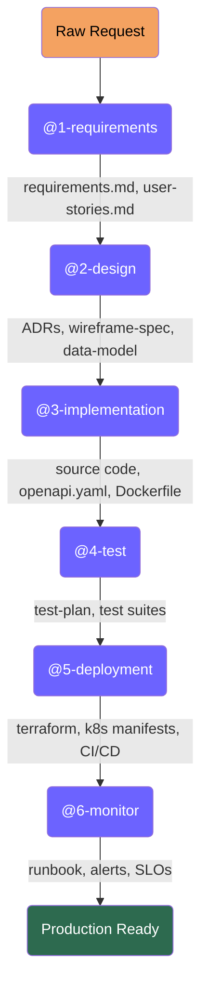

# Agentic Build Pipeline for Enterprise Software Development

[](LICENSE)
[](https://github.com/features/copilot)
[](https://mermaid.js.org)

A reusable framework that orchestrates six specialized GitHub Copilot agent roles
to take a raw feature request through requirements, design, implementation,
testing, deployment, and monitoring — all governed by enterprise standards.

## The Concept

Rather than six independent AI agents, this pipeline is six **specialized roles**
that GitHub Copilot steps into at each stage of the software development
lifecycle. The power comes from:

1. **Role specialization** — each [`.github/agents/`](.github/agents/) file gives the model
   focused instructions, inputs, and output formats for one stage
2. **Artifact chaining** — each stage's output is the next stage's input,
   creating a traceable, reviewable audit trail
3. **Enterprise governance** — [`governance/enterprise-standards.md`](governance/enterprise-standards.md) constrains
   every agent, so technology decisions stay within approved boundaries automatically

## Pipeline at a Glance



> **Legend:** Each purple node is an independently defined [Copilot agent](.github/agents/) with its own role instructions, allowed tools, and validation gates. Arrows show the artifacts that flow between stages. See [`governance/agent-pipeline-overview.md`](governance/agent-pipeline-overview.md) for the full diagram.

## Skills — Cross-Cutting Methodology

Agents define **what** to produce. Skills define **how** to work. Skills are
reusable behavioral patterns in [`.github/skills/`](.github/skills/) that are
referenced by agents when relevant:

| Skill | Used By | Purpose |
|-------|---------|---------|
| [`verification-before-completion`](.github/skills/verification-before-completion/) | All agents | Evidence before claims — run verification commands and cite output before marking gates as passed |
| [`systematic-debugging`](.github/skills/systematic-debugging/) | @3, @4, @5, @7 | 4-phase root cause investigation when lint, tests, or builds fail |
| [`test-driven-development`](.github/skills/test-driven-development/) | @3 | RED-GREEN-REFACTOR — write failing test before implementation code |
| [`brainstorming`](.github/skills/brainstorming/) | @2 | Explore 2-3 design alternatives with trade-offs before producing ADRs |
| [`writing-plans`](.github/skills/writing-plans/) | @3 | Break implementation into bite-sized tasks with verification steps before coding |
| [`requesting-code-review`](.github/skills/requesting-code-review/) | @3, @4 | Structured mid-pipeline review to catch issues before they cascade |
| [`receiving-code-review`](.github/skills/receiving-code-review/) | @3, @4 | Handle review findings: prioritize by severity, fix without refactoring |
| [`eliciting-requirements`](.github/skills/eliciting-requirements/) | @1 | Guide structured conversation to capture problem, users, and constraints when no input document exists |

> [!NOTE]
> Skills are inspired by the composable methodology approach from
> [obra/superpowers](https://github.com/obra/superpowers). They're adapted here
> to work with GitHub Copilot's native skills system and integrate into the
> enterprise pipeline workflow.

## Prerequisites

> [!IMPORTANT]
> This repo requires **VS Code** with the [GitHub Copilot extension](https://marketplace.visualstudio.com/items?itemName=GitHub.copilot)
> and a **GitHub Copilot** subscription with agent mode enabled (Copilot Pro, Business, or Enterprise).
> You must **open this folder as the workspace root** — the agents and workspace instructions
> are discovered automatically from `.github/`.

## Quick Start

> [!NOTE]
> The input can be anything — a casual stream-of-consciousness paragraph, a Slack thread
> copy-paste, or a formal Business Requirements Document. The @1-requirements agent
> normalizes any input format into structured engineering requirements. See
> [`projects/expense-portal/input/request.md`](projects/expense-portal/input/request.md) for an informal example and
> [`projects/expense-portal/input/business-requirements.md`](projects/expense-portal/input/business-requirements.md) for a formal one.

1. Drop a feature request into `projects/<project>/input/`
2. Select **@1-requirements** in the Copilot Chat agent picker
3. Review the output in `projects/<project>/requirements/`
4. Repeat with each agent in order: **@2-design** → **@3-implementation** → **@4-test** → **@5-deployment** → **@6-monitor**

## Key Files

| File | Purpose |
|------|---------|
| [`.github/copilot-instructions.md`](.github/copilot-instructions.md) | Workspace instructions (auto-loaded by Copilot) |
| [`governance/enterprise-standards.md`](governance/enterprise-standards.md) | Non-negotiable constraints for all agents |
| [`.github/agents/*.agent.md`](.github/agents/) | Copilot custom agent definitions (appear in agent picker) |
| [`.github/skills/`](.github/skills/) | Cross-cutting methodology skills (shared across agents) |
| [`templates/`](templates/) | Reusable output templates (all 6 stages) |
| [`.github/PULL_REQUEST_TEMPLATE.md`](.github/PULL_REQUEST_TEMPLATE.md) | PR checklist enforcing standards |
| [`.github/workflows/ci-template.yml.template`](.github/workflows/ci-template.yml.template) | Python CI pipeline template |
| [`.github/workflows/ci-template-go.yml.template`](.github/workflows/ci-template-go.yml.template) | Go CI pipeline template |
| [`WALKTHROUGH.md`](WALKTHROUGH.md) | Step-by-step demo walkthrough with prompts and talking points |
| [`docs/architecture/platform-architecture.md`](docs/architecture/platform-architecture.md) | Cross-project platform architecture with Mermaid diagrams |
| [`docs/runbooks/platform-incident-response.md`](docs/runbooks/platform-incident-response.md) | Cross-cutting incident response runbook (AKS, PostgreSQL, Redis, CI/CD) |

## Included Projects

| Project | Status | Purpose |
|---------|--------|---------|
| [`projects/expense-portal/`](projects/expense-portal/) | Requirements → Design → Implementation → Tests | **Golden path reference** — includes both an informal [`request.md`](projects/expense-portal/input/request.md) and a formal [`business-requirements.md`](projects/expense-portal/input/business-requirements.md) to demonstrate flexible input, plus full pipeline output through stage 4 |
| [`projects/policy-chatbot/`](projects/policy-chatbot/) | Full pipeline (7 stages) | **Skills showcase** — full pipeline run demonstrating all 8 skills in action, from BRD input through review. PASS on first @7-review with 0 critical findings |

## Enterprise Standards Summary

> [!TIP]
> These standards are an **example governance framework** included to demonstrate
> how enterprise constraints flow through the pipeline. They are defined in
> [`governance/enterprise-standards.md`](governance/enterprise-standards.md) and
> enforced via platform-wide ADRs in [`docs/adr/`](docs/adr/). Customize them
> to match your organization's policies.

- **Languages:** Python 3.11+ and Go 1.22+ only ([ADR-0001](docs/adr/ADR-0001-language-selection.md))
- **Data Storage:** Azure Database for PostgreSQL ([ADR-0002](docs/adr/ADR-0002-data-storage.md))
- **Async Processing:** Celery + Redis ([ADR-0003](docs/adr/ADR-0003-email-notifications.md))
- **Authentication:** Microsoft Entra ID / OIDC ([ADR-0004](docs/adr/ADR-0004-platform-authentication.md))
- **Containers:** Docker (multi-stage builds, non-root, distroless base)
- **Orchestration:** Kubernetes on AKS
- **CI/CD:** GitHub Actions with mandatory lint → test → security → build → integration stages
- **Secrets:** Azure Key Vault only; never in code or config files
- **Observability:** Structured JSON logs + Prometheus metrics + OpenTelemetry traces (all via Azure Monitor)

## Agent Quality Gates

Each code-producing agent runs local verification before committing. These
mirror what CI enforces, catching issues before they reach the pipeline:

| Check | Agent 3 (Implementation) | Agent 4 (Test) | Agent 7 (Review) |
|-------|--------------------------|----------------|-------------------|
| `uvx ruff check` | ✅ Required | — | ✅ Required |
| `uvx ruff format --check` | ✅ Required | — | ✅ Required |
| `python -m pytest` | ✅ If tests exist | ✅ Required | ✅ Required |

Additional constraints enforced by the implementation agent:
- No `get_settings()` or Azure SDK initialization at module scope
- All external service clients via FastAPI dependency injection (mockable in tests)
- CI test steps must set placeholder env vars for all `Settings` fields

## Deployment Prerequisites

Use the bootstrap script to validate and provision Azure resources:

```bash
# Check what's needed
./scripts/check-prerequisites.sh <project> dev

# Auto-create missing resources
./scripts/check-prerequisites.sh <project> dev --fix

# Target a specific Azure tenant + subscription
./scripts/check-prerequisites.sh <project> dev --tenant <id> -s "Sub Name" --fix
```

The script validates: Azure resource groups, ACR, OpenAI, Entra ID app
registration, service principal with OIDC federated credentials, GitHub
secrets, GitHub environments, and project files.
