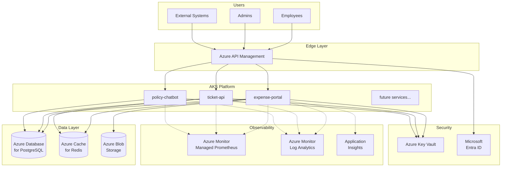
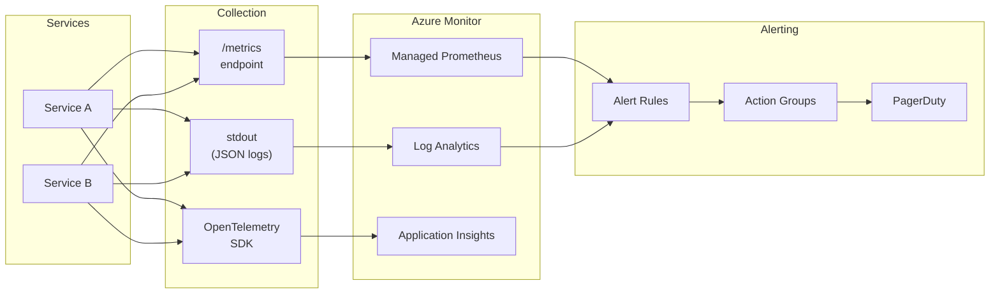
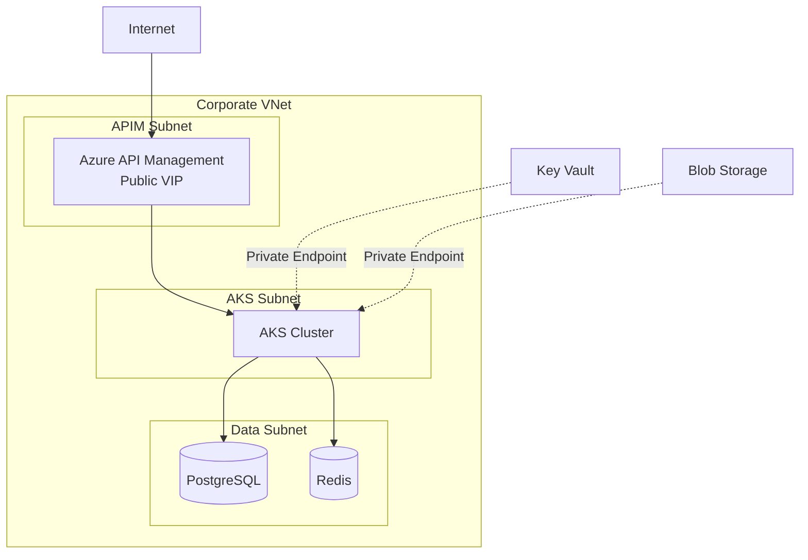
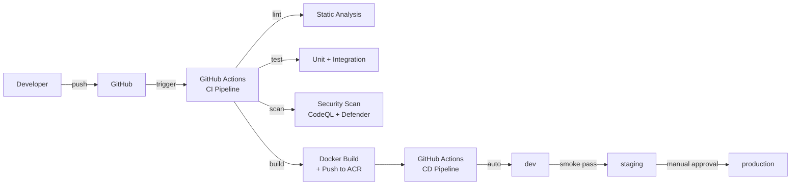

# Platform Architecture — Acme Corporation

> Version: 1.0 | Owner: Platform Engineering | Last Updated: 2026-03

This document describes the shared platform that all services deployed through
the agentic build pipeline run on. Individual project architecture docs live in
`projects/<project>/design/architecture-overview.md`; this document covers the
cross-cutting infrastructure they all share.

---

## System Context

---

## Shared Infrastructure Components

| Component | Service | Purpose |
|-----------|---------|---------|
| API Gateway | Azure API Management | TLS termination, rate limiting, auth, WAF |
| Compute | Azure Kubernetes Service (AKS) | Container orchestration for all services |
| Container Registry | Azure Container Registry (ACR) | OCI image storage, vulnerability scanning |
| Database | Azure Database for PostgreSQL Flexible Server | Managed relational data (per-service databases) |
| Cache | Azure Cache for Redis | Session state, task queues, caching |
| Object Storage | Azure Blob Storage | Receipt images, file uploads, document storage |
| Secrets | Azure Key Vault | Credentials, connection strings, API keys |
| Identity | Microsoft Entra ID | OAuth 2.0 / OIDC for user and service auth |
| DNS | Azure DNS | Service discovery and public DNS |

---

## Observability Stack

All services emit telemetry to a shared observability platform:

| Signal | Format | Collection | Backend |
|--------|--------|------------|---------|
| Logs | Structured JSON to stdout | Container log driver | Azure Monitor Log Analytics |
| Metrics | Prometheus `/metrics` endpoint | Azure Monitor managed Prometheus scrape | Grafana / Azure dashboards |
| Traces | OpenTelemetry SDK (OTLP) | OTel Collector sidecar | Application Insights |

---

## Network Architecture

- All service-to-service communication is within the VNet (no public endpoints for data services)
- Azure API Management is the only public ingress point
- NetworkPolicy (default-deny) is enforced in every AKS namespace
- TLS 1.2+ on all connections

---

## CI/CD Platform

All pipelines follow the mandatory stages defined in `governance/enterprise-standards.md`:
lint → test → security → build → integration. No stage may be skipped.

---

## Service Onboarding

When a new project goes through the agentic pipeline, it automatically gets:

1. **Namespace isolation** — dedicated AKS namespace with NetworkPolicy
2. **Dedicated service account** — no shared credentials
3. **Secrets via External Secrets Operator** — pulling from Key Vault
4. **Prometheus scrape config** — automatic via pod annotations
5. **CI/CD workflows** — generated by @5-deployment agent
6. **Alerting + runbook** — generated by @6-monitor agent

No manual infrastructure provisioning is required beyond running the pipeline.
