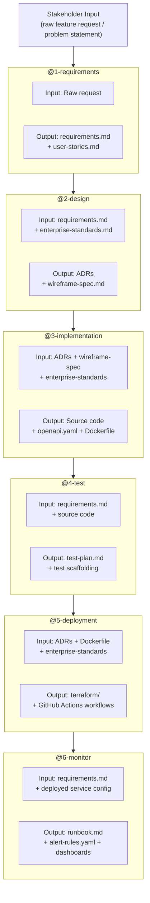

# Agentic Build Pipeline — Overview

This document describes how the six-agent pipeline works end-to-end and how
artifacts flow between stages. Every agent is a native Copilot custom agent
defined in `.github/agents/*.agent.md`, with workspace-wide context from
`.github/copilot-instructions.md` and constrained by
`governance/enterprise-standards.md`.

---

## Pipeline Diagram

---

## Using the Pipeline in GitHub Copilot (VSCode)

Agents are defined in `.github/agents/` and appear automatically in the
Copilot Chat agent picker. Select an agent by name to invoke it.

**Recommended demo flow:**

1. Drop a raw feature request into `projects/<project-name>/input/request.md`
2. Select **@1-requirements** in the agent picker and process the request
3. Save output to `projects/<project-name>/requirements/`
4. Select **@2-design** → feed requirements → save ADRs to `docs/adr/`
5. Select **@3-implementation** → begin coding against the ADR
6. Select **@4-test** → generate test plan
7. Select **@5-deployment** → generate IaC + workflows
8. Select **@6-monitor** → generate runbook + alert config

---

## Artifact Ownership by Stage

| Artifact | Producing Agent | Consuming Agent(s) |
|----------|----------------|-------------------|
| `requirements.md` | Requirements | Design, Test, Monitor |
| `user-stories.md` | Requirements | Design, Test |
| `docs/adr/ADR-XXXX-*.md` | Design | Code, Deployment |
| `wireframe-spec.md` | Design | Code |
| Source code | Implementation (@3-implementation) | Test, Deployment |
| `openapi.yaml` | Implementation (@3-implementation) | Test, Monitor |
| `Dockerfile` | Implementation (@3-implementation) | Deployment |
| `test-plan.md` | Test | — (human review) |
| `terraform/` | Deployment | Monitor |
| `runbook.md` | Monitor | — (ops team) |
| `alert-rules.yaml` | Monitor | — (ops team) |
