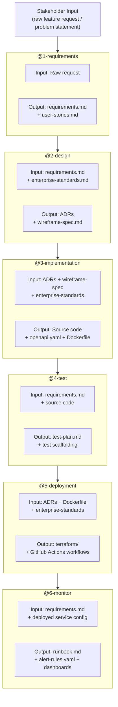

# Agentic Build Pipeline — Overview

This document describes how the six-agent pipeline works end-to-end and how
artifacts flow between stages. Every agent is a native Copilot custom agent
defined in [`.github/agents/`](../.github/agents/), with workspace-wide context from
[`.github/copilot-instructions.md`](../.github/copilot-instructions.md) and constrained by
[`governance/enterprise-standards.md`](enterprise-standards.md).

---

## Pipeline Diagram

---

## Using the Pipeline in GitHub Copilot (VSCode)

Agents are defined in [`.github/agents/`](../.github/agents/) and appear automatically in the
Copilot Chat agent picker. Select an agent by name to invoke it.

> [!IMPORTANT]
> Each agent validates that the previous agent's artifacts exist before starting.
> If inputs are missing, the agent will stop and tell you which earlier agent to
> run first. This ensures the pipeline completes successfully in order.

**Recommended flow:**

1. Drop a feature request into `projects/<project>/input/` (any format — informal notes or formal BRD)
2. Select **@1-requirements** in the agent picker
3. Review the output, then continue with each agent in order:
   **@2-design** → **@3-implementation** → **@4-test** → **@5-deployment** → **@6-monitor**
4. Each agent verifies its outputs before handing off to the next stage

---

## Artifact Ownership by Stage

| Artifact | Producing Agent | Consuming Agent(s) |
|----------|----------------|-------------------|
| `requirements.md` | @1-requirements | @2-design, @4-test, @6-monitor |
| `user-stories.md` | @1-requirements | @2-design, @4-test |
| `docs/adr/ADR-XXXX-*.md` | @2-design | @3-implementation, @5-deployment |
| `wireframe-spec.md` | @2-design | @3-implementation, @4-test |
| `data-model.md` | @2-design | @3-implementation |
| `architecture-overview.md` | @2-design | @3-implementation |
| Source code | @3-implementation | @4-test, @5-deployment |
| `openapi.yaml` | @3-implementation | @4-test, @6-monitor |
| `Dockerfile` | @3-implementation | @5-deployment |
| `test-plan.md` | @4-test | @5-deployment (prerequisite check) |
| `terraform/`, `k8s/` | @5-deployment | @6-monitor |
| CI/CD workflows | @5-deployment | — (GitHub Actions) |
| `runbook.md` | @6-monitor | — (ops team) |
| `alert-rules.yaml` | @6-monitor | — (ops team) |
| `slo-definitions.md` | @6-monitor | — (ops team) |
| `dashboard-spec.md` | @6-monitor | — (ops team) |
