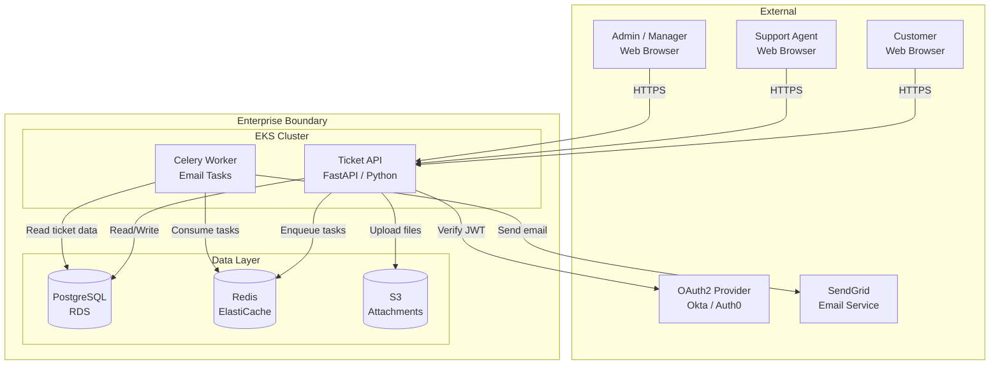

# Architecture Overview: Support Ticket Portal

> **Version:** 1.0
> **Date:** 2026-03-13
> **Produced by:** Design Agent
> **Related ADRs:** ADR-0001, ADR-0002, ADR-0003

---

## System Context Diagram



---

## Component Responsibilities

| Component | Technology | Responsibility |
|-----------|-----------|----------------|
| **Ticket API** | Python 3.11+ / FastAPI | REST API, auth, business logic, search |
| **Celery Worker** | Python / Celery | Async email dispatch, background processing |
| **PostgreSQL** | RDS PostgreSQL 16 | Tickets, comments, users, full-text search |
| **Redis** | ElastiCache | Celery broker + result backend |
| **S3** | AWS S3 | Receipt/attachment file storage |
| **OAuth2 Provider** | External (Okta) | Authentication, JWT issuance |
| **SendGrid** | External SaaS | Transactional email delivery |

---

## Data Flow: Ticket Submission

```
1. Customer → API:     POST /v1/tickets (subject, description, priority)
2. API → OAuth:        Verify JWT token
3. API → PostgreSQL:   INSERT ticket row, trigger updates search_vector
4. API → Customer:     201 Created with ticket_number
```

## Data Flow: Status Change + Notification

```
1. Agent → API:        PATCH /v1/tickets/{id} (status: "in_progress")
2. API → PostgreSQL:   UPDATE ticket status, set updated_at
3. API → Redis:        Enqueue send_status_notification task
4. API → Agent:        200 OK with updated ticket
5. Worker ← Redis:     Dequeue notification task
6. Worker → PG:        Read ticket + customer email
7. Worker → SendGrid:  Send status change email
```

---

## Deployment Architecture

```
EKS Namespace: ticket-portal
├── Deployment: ticket-api       (2–10 replicas, HPA on CPU 70%)
├── Deployment: celery-worker    (2–5 replicas, HPA on queue depth)
├── Service: ticket-api-svc      (ClusterIP, port 8000)
├── HPA: ticket-api-hpa
├── HPA: celery-worker-hpa
├── PDB: ticket-api-pdb          (minAvailable: 1)
├── PDB: celery-worker-pdb       (minAvailable: 1)
├── NetworkPolicy: default-deny + allow ingress from API Gateway
├── ServiceAccount: ticket-api-sa
├── ExternalSecret: db-credentials
├── ExternalSecret: redis-credentials
├── ExternalSecret: sendgrid-api-key
└── Ingress: via API Gateway (Kong / AWS API Gateway)
```

---

## Security Boundaries

| Boundary | Control |
|----------|---------|
| Internet → API | API Gateway (WAF, rate limiting, TLS termination) |
| API → Database | VPC security group, IAM auth |
| API → Redis | VPC security group, AUTH token |
| API → S3 | IAM role (IRSA), pre-signed URLs for client uploads |
| API → OAuth | HTTPS, JWT signature verification |
| Worker → SendGrid | HTTPS, API key from Secrets Manager |
