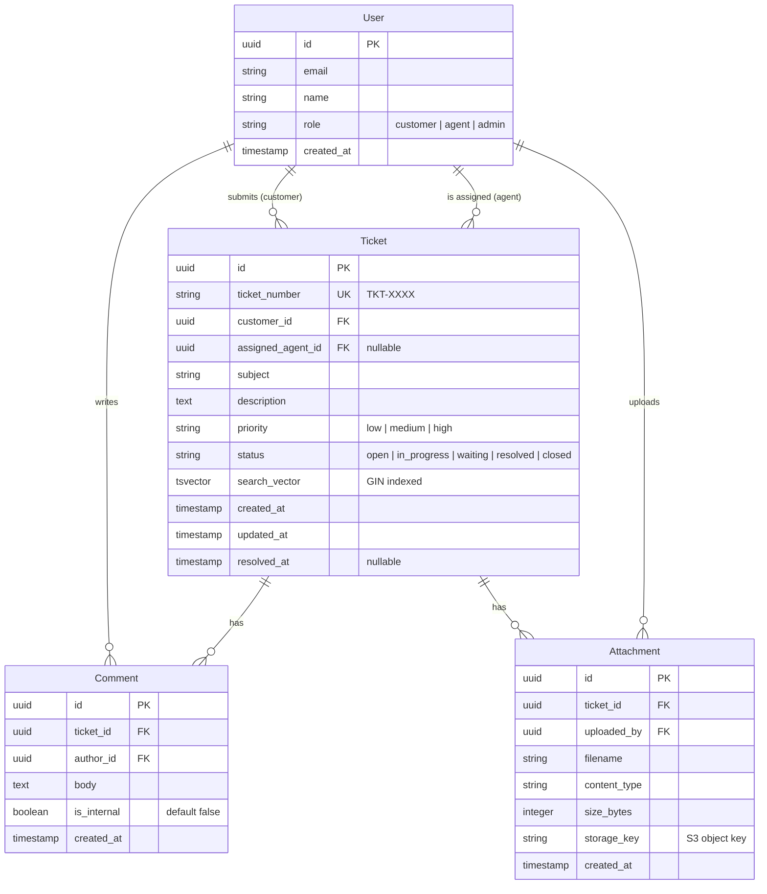

# Data Model: Support Ticket Portal

> **Version:** 1.0
> **Date:** 2026-03-13
> **Produced by:** Design Agent
> **Related ADRs:** ADR-0002 (data storage)

---

## Entity Relationship Diagram



---

## Table Details

### `users`
| Column | Type | Constraints | Notes |
|--------|------|-------------|-------|
| id | uuid | PK, default gen_random_uuid() | |
| email | varchar(255) | UNIQUE, NOT NULL | From OAuth2 provider |
| name | varchar(255) | NOT NULL | |
| role | varchar(20) | NOT NULL, CHECK | customer, agent, admin |
| created_at | timestamptz | NOT NULL, default now() | |

### `tickets`
| Column | Type | Constraints | Notes |
|--------|------|-------------|-------|
| id | uuid | PK | |
| ticket_number | varchar(20) | UNIQUE, NOT NULL | Auto-generated: TKT-XXXX |
| customer_id | uuid | FK → users.id, NOT NULL | |
| assigned_agent_id | uuid | FK → users.id, NULLABLE | |
| subject | varchar(255) | NOT NULL | |
| description | text | NOT NULL | |
| priority | varchar(10) | NOT NULL, CHECK | low, medium, high |
| status | varchar(20) | NOT NULL, default 'open' | |
| search_vector | tsvector | GIN INDEX | FR-010 search |
| created_at | timestamptz | NOT NULL | |
| updated_at | timestamptz | NOT NULL | |
| resolved_at | timestamptz | NULLABLE | Set when status → resolved |

### `comments`
| Column | Type | Constraints | Notes |
|--------|------|-------------|-------|
| id | uuid | PK | |
| ticket_id | uuid | FK → tickets.id, NOT NULL | CASCADE delete |
| author_id | uuid | FK → users.id, NOT NULL | |
| body | text | NOT NULL | |
| is_internal | boolean | NOT NULL, default false | Internal notes hidden from customers |
| created_at | timestamptz | NOT NULL | |

### `attachments`
| Column | Type | Constraints | Notes |
|--------|------|-------------|-------|
| id | uuid | PK | |
| ticket_id | uuid | FK → tickets.id, NOT NULL | |
| uploaded_by | uuid | FK → users.id, NOT NULL | |
| filename | varchar(255) | NOT NULL | Original filename |
| content_type | varchar(100) | NOT NULL | MIME type |
| size_bytes | integer | NOT NULL | Validated ≤ 10MB |
| storage_key | varchar(500) | NOT NULL | S3 object key |
| created_at | timestamptz | NOT NULL | |

---

## Indexes

| Table | Index | Type | Purpose |
|-------|-------|------|---------|
| tickets | ticket_number | UNIQUE B-tree | Lookup by ticket number |
| tickets | customer_id | B-tree | Customer's ticket list |
| tickets | assigned_agent_id | B-tree | Agent's queue |
| tickets | status | B-tree | Filter by status |
| tickets | search_vector | GIN | Full-text search (FR-010) |
| tickets | created_at | B-tree | Date range queries |
| comments | ticket_id, created_at | B-tree | Chronological comment loading |
| attachments | ticket_id | B-tree | Ticket attachments lookup |

---

## Search Vector Trigger

```sql
-- Trigger to keep search_vector in sync with searchable fields
CREATE OR REPLACE FUNCTION tickets_search_vector_update() RETURNS trigger AS $$
BEGIN
  NEW.search_vector :=
    setweight(to_tsvector('english', coalesce(NEW.subject, '')), 'A') ||
    setweight(to_tsvector('english', coalesce(NEW.description, '')), 'B');
  RETURN NEW;
END;
$$ LANGUAGE plpgsql;

CREATE TRIGGER tickets_search_vector_trigger
  BEFORE INSERT OR UPDATE OF subject, description
  ON tickets
  FOR EACH ROW
  EXECUTE FUNCTION tickets_search_vector_update();
```
