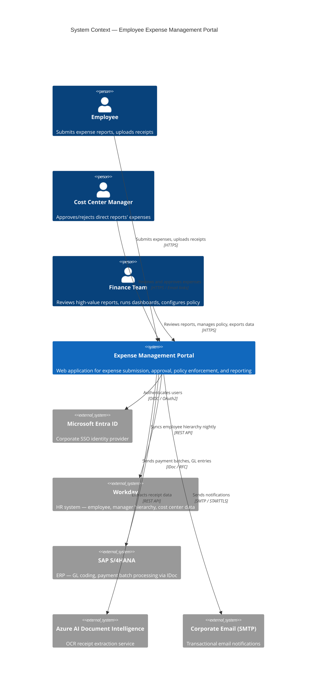
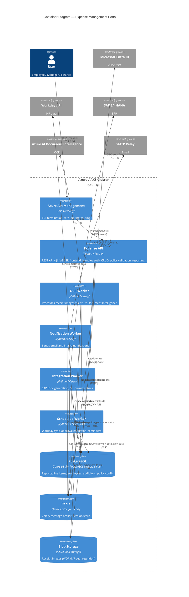
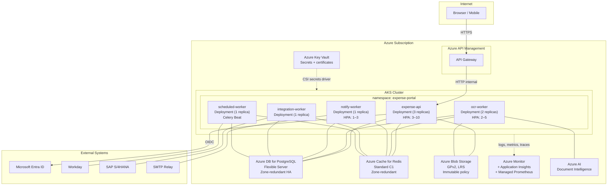

# Architecture Overview: Employee Expense Management Portal

> **Version:** 1.0
> **Date:** 2026-03-13
> **Produced by:** Design Agent
> **Project:** expense-portal (FIN-EXP-2026)
> **Related ADRs:** ADR-0001, ADR-0002, ADR-0003, ADR-0004, ADR-0005, ADR-0006

---

## System Context Diagram



---

## Component Diagram



---

## Deployment Architecture



---

## Component Responsibilities

### Expense API (FastAPI)
- **Auth:** OIDC login/callback/logout, session management, RBAC middleware
- **Expense CRUD:** Create/read/update reports and line items, draft management
- **Submission:** Policy validation, duplicate detection, approval routing
- **Approvals:** Approve/reject/request-info endpoints, email action token validation
- **Dashboards:** Finance and manager reporting queries, CSV export
- **Admin:** Category, per diem, and threshold management
- **Frontend:** Server-rendered Jinja2 templates with HTMX for interactivity
- **Operational:** `/health`, `/ready`, `/metrics` endpoints

### OCR Worker (Celery)
- Consumes receipt upload tasks from the `ocr` queue
- Downloads receipt from Blob Storage → calls Azure Document Intelligence → extracts fields with confidence scores → updates line item in PostgreSQL
- Retries with exponential backoff on transient failures

### Notification Worker (Celery)
- Consumes notification tasks from the `notifications` queue
- Sends transactional email via SMTP relay
- Creates in-app notification records in PostgreSQL
- Generates single-use action tokens for email approval links

### Integration Worker (Celery)
- Consumes from the `integrations` queue
- Generates SAP IDoc payment batch files from approved reports
- Writes GL journal entry records to SAP
- Updates report status to `payment_processing`
- Retries with backoff on SAP unavailability; queues for manual review after max retries

### Scheduled Worker (Celery Beat)
- `sync_workday` (daily 02:00 UTC): syncs employees, managers, cost centers from Workday API
- `check_stale_approvals` (daily 08:00 UTC): escalates reports pending > 5 business days
- `send_approval_reminders` (daily 08:00 UTC): reminds approvers of reports pending > 3 business days

---

## Cross-Cutting Concerns

### Security
| Concern | Implementation |
|---------|---------------|
| Authentication | Microsoft Entra ID OIDC (ADR-0006) |
| Authorization | Application-level RBAC with Workday-derived hierarchy |
| Secrets | Azure Key Vault → AKS CSI secrets driver |
| TLS | 1.2+ everywhere — APIM terminates external TLS; internal uses service mesh mTLS |
| Email action links | Single-use, 30-minute expiry, SSO required before action execution |
| CSRF | SameSite=Lax cookies + CSRF tokens on state-changing Jinja2 forms |
| Input validation | Pydantic models validate all API input; parameterized SQL queries (SQLAlchemy) |

### Observability
| Signal | Implementation | Destination |
|--------|---------------|-------------|
| Logs | structlog → stdout (JSON format) | Azure Monitor Logs |
| Metrics | prometheus-fastapi-instrumentator + Celery Prometheus exporter | Azure Monitor managed Prometheus |
| Traces | OpenTelemetry SDK (azure-monitor-opentelemetry) | Application Insights |
| Health | `/health` (liveness), `/ready` (readiness with DB + Redis checks) | AKS kubelet probes |

### Resilience
| Failure Scenario | Handling |
|------------------|----------|
| PostgreSQL unavailable | `/ready` returns 503 → AKS stops routing traffic; API returns 503 to user |
| Redis unavailable | `/ready` returns 503; tasks queue in API memory briefly, processed when Redis recovers |
| Azure Document Intelligence unavailable | OCR task retries with backoff; receipt upload succeeds, OCR pre-fill skipped; user enters fields manually |
| SAP unavailable | Integration task retries with backoff; report stays in `approved` status; alert sent to ops |
| Workday API unavailable | Sync retries 3x with backoff; previous day's data remains; alert sent to ops |
| SMTP unavailable | Notification task retries; in-app notification still created in DB |

---

## Network Architecture

```
Internet → Azure API Management (public IP, TLS termination, WAF)
         → AKS Ingress Controller (internal)
         → expense-api Service (ClusterIP)

All backend services (PostgreSQL, Redis, Blob, Key Vault, Document Intelligence)
accessed via Azure Private Endpoints within the AKS VNet.

No direct public access to any backend service.
```

---

## Scaling Strategy

| Component | Min Replicas | Max Replicas | Scale Trigger |
|-----------|-------------|-------------|---------------|
| expense-api | 3 | 10 | CPU > 70% or request latency p95 > 1.5s |
| ocr-worker | 2 | 5 | Queue depth > 10 |
| notify-worker | 1 | 3 | Queue depth > 50 |
| integration-worker | 1 | 1 | Not scaled — SAP has rate limits |
| scheduled-worker | 1 | 1 | Singleton — Celery Beat leader election |

Target capacity: 1,500 concurrent users (NFR-013) with 3x headroom via HPA scaling.

---

## Quality Checklist

- [x] Every functional requirement (FR-001–FR-024) maps to a specific component
- [x] All technology choices are permitted by enterprise-standards.md
- [x] Every ADR documents alternatives considered and rejection reasons
- [x] API endpoints in wireframe-spec are complete enough to generate test cases
- [x] Data model covers all entities implied by the requirements
- [x] Observability requirements (NFR-016–NFR-019) addressed in architecture
- [x] Security requirements (NFR-007–NFR-012) addressed with specific implementations
- [x] Compliance requirements (NFR-014–NFR-015) supported by data model design
