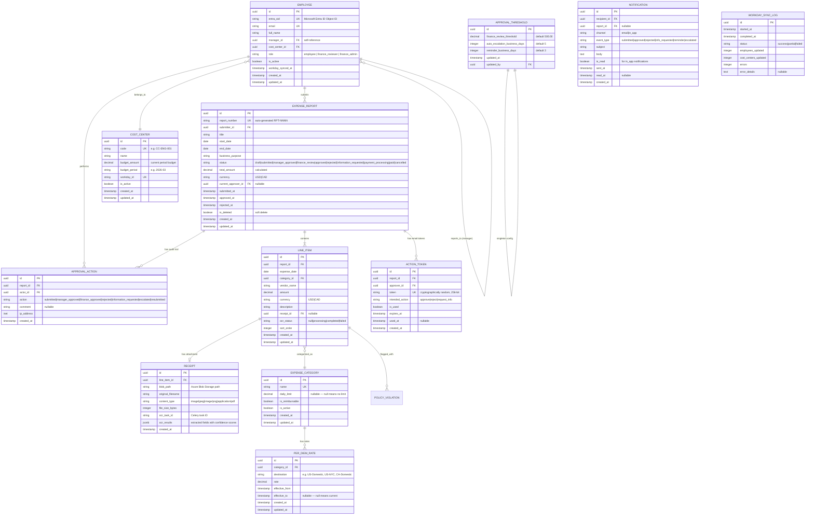
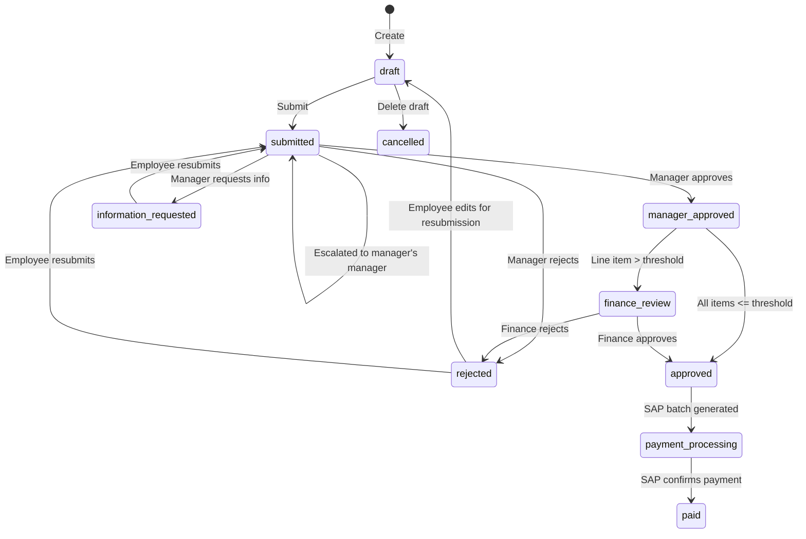
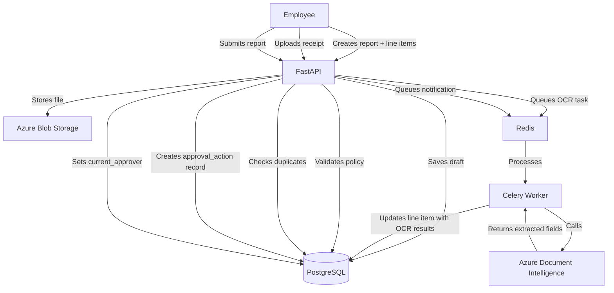
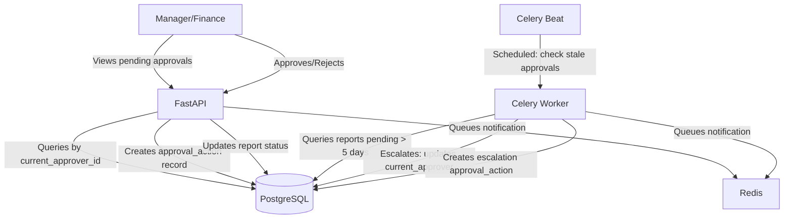
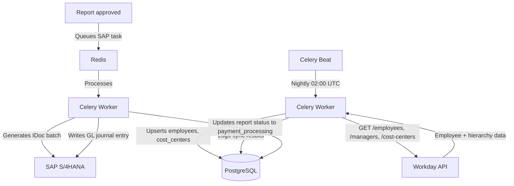

# Data Model: Employee Expense Management Portal

> **Version:** 1.0
> **Date:** 2026-03-13
> **Produced by:** Design Agent
> **Related ADRs:** ADR-0002 (data storage), ADR-0004 (authentication), ADR-0005 (blob storage)

---

## Overview

All relational data is stored in Azure Database for PostgreSQL — Flexible Server (ADR-0005). Receipt files are stored in Azure Blob Storage. The data model supports:

- Expense report creation and lifecycle management
- Multi-level approval workflow with immutable audit trail
- Configurable policy engine (categories, per diem rates, thresholds)
- Workday-synced employee/manager/cost center hierarchy
- SOX compliance: append-only audit logs, soft deletes, no post-approval mutation

---

## Entity Relationship Diagram

---

## Entity Descriptions

### EMPLOYEE
Represents a user of the system. Synced nightly from Workday (FR-016). The `entra_oid` is the unique identifier from Microsoft Entra ID used for authentication matching (ADR-0006). The `role` field determines application-level permissions. Manager relationship is a self-referencing foreign key derived from Workday hierarchy.

**Indexes:**
- `entra_oid` — unique, used for login lookup
- `email` — unique
- `manager_id` — for approval routing and manager dashboard queries
- `cost_center_id` — for reporting aggregation

### COST_CENTER
Organizational cost center from Workday. Budget amounts are maintained per period for the manager dashboard (FR-020).

### EXPENSE_REPORT
The core entity. Tracks the full lifecycle from draft through payment. The `status` field is the state machine driver for the approval workflow.

**State machine:**

**Indexes:**
- `submitter_id, status` — for employee dashboard (own reports filtered by status)
- `current_approver_id, status` — for approval queue (pending reports for a specific approver)
- `submitted_at` — for reporting date range queries
- `status` — for finance dashboard filtering

**Constraints:**
- `CHECK (end_date >= start_date)`
- `CHECK (status IN ('draft','submitted','manager_approved','finance_review','approved','rejected','information_requested','payment_processing','paid','cancelled'))`

### LINE_ITEM
Individual expense entries within a report. Each line item has an optional receipt attachment and is validated against the policy engine at submission time.

**Indexes:**
- `report_id, sort_order` — for ordered retrieval within a report
- `(submitter via report).id, expense_date, amount, vendor_name` — for duplicate detection (FR-007)

### RECEIPT
Metadata for receipt files stored in Azure Blob Storage. The `blob_path` references the file in Blob Storage; the actual file is never stored in PostgreSQL. OCR results are stored as JSONB for flexible schema.

### EXPENSE_CATEGORY
Admin-configurable expense categories (FR-024). The `daily_limit` is enforced by the policy engine at submission time.

### PER_DIEM_RATE
Destination-specific per diem rates per category (FR-014). Supports temporal validity (`effective_from`/`effective_to`) so rate changes don't retroactively affect existing reports.

### APPROVAL_ACTION
**Append-only audit trail** (NFR-011, NFR-015). No UPDATE or DELETE operations are permitted on this table. Every state change on an expense report creates a new row. Captures actor, action, timestamp, IP address, and optional comment.

**Database enforcement:**
- No UPDATE/DELETE triggers (or revoke UPDATE/DELETE from application role)
- `created_at` set by database default, not application code

**Retention:** 7 years per NFR-011 and NFR-014.

### ACTION_TOKEN
Single-use, time-bounded tokens for email approval action links (ADR-0006, GF-007). Tokens are cryptographically random, expire after 30 minutes, and are marked used after first use to prevent replay.

### APPROVAL_THRESHOLD
Singleton configuration table for system-wide approval settings. Managed by Finance Administrators via the admin panel (FR-024).

### NOTIFICATION
Tracks both email and in-app notifications. In-app notifications support read/unread state for the notification indicator in the UI.

### WORKDAY_SYNC_LOG
Operational logging for the nightly Workday sync job. Used for monitoring and troubleshooting sync failures.

---

## Data Flow Diagrams

### Expense Submission Flow

### Approval Flow

### Integration Flow

---

## Storage Strategy

| Data Type | Storage | Encryption | Retention |
|-----------|---------|------------|-----------|
| Relational data (reports, line items, employees) | PostgreSQL | TDE (AES-256, platform-managed key) | Active data: indefinite; soft-deleted: 7 years |
| Audit trail (approval_actions) | PostgreSQL | TDE (AES-256) | 7 years (NFR-011) — append-only, no purge |
| Receipt images | Azure Blob Storage | SSE (AES-256) | 7 years (NFR-014) — immutable WORM policy |
| Receipt images > 90 days | Azure Blob Storage Cool tier | SSE (AES-256) | Auto-tiered via lifecycle policy |
| Celery task results | PostgreSQL | TDE (AES-256) | 30 days TTL |
| Session data | Redis | In-transit TLS, at-rest encryption | Session TTL (24 hours) |
