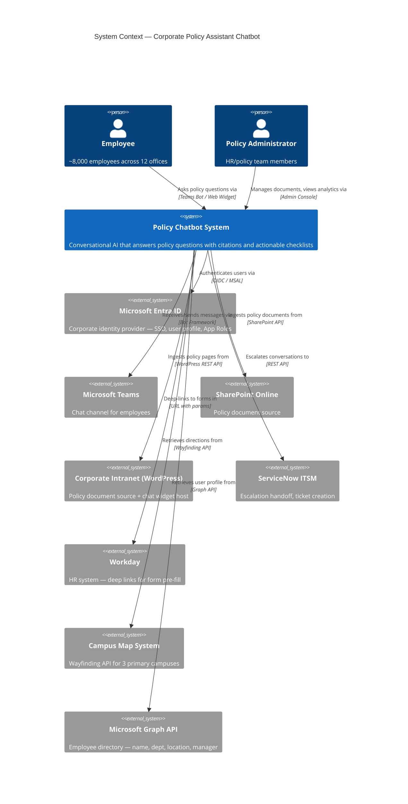

# Architecture Overview: Policy Chatbot

> **Version:** 1.0
> **Date:** 2026-03-16
> **Produced by:** Design Agent
> **Related ADRs:** ADR-0007, ADR-0008, ADR-0009, ADR-0010, ADR-0011

---

## 1. System Context Diagram



---

## 2. Component Diagram

```mermaid
C4Container
    title Container Diagram — Policy Chatbot System

    Person(employee, "Employee")
    Person(admin, "Policy Administrator")

    System_Boundary(chatbot_system, "Policy Chatbot System") {

        Container(web_widget, "Web Chat Widget", "Static Web App (HTML/CSS/JS)", "Intranet-embedded chat interface")
        Container(admin_ui, "Admin Console UI", "Static Web App (HTML/CSS/JS)", "Document management, analytics, test queries")
        Container(api_server, "Chat & Admin API", "Python / FastAPI on ACA", "Chat API, admin API, health/ready endpoints")
        Container(celery_worker, "Ingestion Worker", "Python / Celery on ACA Jobs", "Document extraction, chunking, embedding, indexing")
        Container(teams_bot, "Teams Bot Adapter", "Python / Bot Framework on ACA", "Receives Teams messages, translates to Chat API calls")

        ContainerDb(postgres, "PostgreSQL", "Azure Database for PostgreSQL Flexible Server", "Documents metadata, conversations, feedback, analytics, version history")
        ContainerDb(ai_search, "Azure AI Search", "Azure AI Search (Standard S1)", "Vector embeddings + full-text index of policy document chunks")
        ContainerDb(redis, "Redis", "Azure Cache for Redis", "Session state, conversation context, Celery broker")
        ContainerDb(blob, "Blob Storage", "Azure Blob Storage", "Raw policy document files (PDF, DOCX)")
    }

    System_Ext(aoai, "Azure OpenAI Service", "GPT-4o chat completion, text-embedding-3-large")
    System_Ext(entra, "Microsoft Entra ID", "SSO authentication, App Roles, Graph API")
    System_Ext(teams, "Microsoft Teams", "Employee chat channel")
    System_Ext(servicenow, "ServiceNow", "Escalation handoff")
    System_Ext(campusmap, "Campus Map", "Wayfinding API")
    System_Ext(apim, "Azure API Management", "API gateway — rate limiting, TLS termination")

    Rel(employee, web_widget, "Chats via", "HTTPS")
    Rel(employee, teams, "Chats via", "Teams client")
    Rel(admin, admin_ui, "Manages via", "HTTPS")

    Rel(web_widget, apim, "API calls", "HTTPS/WSS")
    Rel(admin_ui, apim, "API calls", "HTTPS")
    Rel(teams, teams_bot, "Messages", "Bot Framework")
    Rel(teams_bot, api_server, "Internal API calls", "HTTPS")

    Rel(apim, api_server, "Routes to", "HTTPS")
    Rel(api_server, aoai, "Chat completion + embeddings", "HTTPS")
    Rel(api_server, ai_search, "Hybrid search queries", "HTTPS")
    Rel(api_server, postgres, "CRUD operations", "TLS")
    Rel(api_server, redis, "Session + cache", "TLS")
    Rel(api_server, servicenow, "Escalation handoff", "HTTPS")
    Rel(api_server, campusmap, "Wayfinding lookup", "HTTPS")
    Rel(api_server, entra, "Token validation, Graph API", "HTTPS")

    Rel(celery_worker, blob, "Reads raw documents", "HTTPS")
    Rel(celery_worker, ai_search, "Indexes chunks + embeddings", "HTTPS")
    Rel(celery_worker, aoai, "Generates embeddings", "HTTPS")
    Rel(celery_worker, postgres, "Updates metadata + version history", "TLS")
    Rel(celery_worker, redis, "Task broker", "TLS")
```



---

## 3. Component Responsibilities

| Component | Technology | Purpose | Scaling |
|-----------|-----------|---------|---------|
| **Web Chat Widget** | Azure Static Web Apps | Intranet-embedded chat UI for employees | CDN-backed, auto-scaled |
| **Admin Console UI** | Azure Static Web Apps | Document management, analytics dashboard, test query tool | CDN-backed, auto-scaled |
| **Chat & Admin API** | FastAPI on Azure Container Apps | Core API: chat endpoint, admin endpoints, health/ready | Min 2, max 10 replicas (HTTP scaling) |
| **Teams Bot Adapter** | Bot Framework SDK on ACA | Receives Teams messages, translates to internal Chat API format | Min 1, max 5 replicas |
| **Ingestion Worker** | Celery on ACA Jobs | Document extraction, chunking, embedding generation, AI Search indexing | Scales on Redis queue depth |
| **PostgreSQL** | Azure DB for PostgreSQL Flexible Server | Relational data: metadata, conversations, feedback, analytics | General Purpose, 4 vCores |
| **Azure AI Search** | Azure AI Search (Standard S1) | Vector + keyword index of policy document chunks | Managed scaling |
| **Redis** | Azure Cache for Redis (Standard C1) | Conversation session state, user profile cache, Celery broker | Managed |
| **Blob Storage** | Azure Blob Storage (Standard LRS) | Raw policy document file storage | Managed |
| **Azure OpenAI** | Azure OpenAI Service | GPT-4o (chat), text-embedding-3-large (embeddings) | Managed, quota-based |
| **API Management** | Azure API Management | API gateway: rate limiting, TLS termination, CORS, auth | Managed |

---

## 4. Data Flow — Chat Query

```
1. Employee sends message via Teams or Web Widget
2. Message arrives at API gateway (Azure API Management)
3. API Management validates OAuth token, applies rate limiting, routes to Chat API
4. Chat API extracts user_id from JWT, loads session context from Redis
5. Intent classifier categorizes the query:
   a. Confidential topic → bypass RAG, return escalation offer (FR-016)
   b. Policy question → continue to step 6
6. Chat API generates query embedding via Azure OpenAI (text-embedding-3-large)
7. Chat API executes hybrid search against Azure AI Search (vector + BM25)
8. Semantic ranker re-ranks results; top-k chunks selected
9. Prompt assembled: system prompt + retrieved chunks + conversation history + user query
10. Azure OpenAI GPT-4o generates response (answer + citations + optional checklist)
11. Response parser extracts structured output (citations, checklist items)
12. For Assisted checklist items: enrich with deep links (ServiceNow, Workday, campus map)
13. Disclaimer appended to response
14. Response returned to employee; conversation context updated in Redis
15. Feedback buttons presented; feedback stored in PostgreSQL
```

---

## 5. Data Flow — Document Ingestion

```
1. Admin uploads document via Admin Console UI → Blob Storage
2. Admin triggers re-indexing via Admin API
3. API creates Celery task in Redis queue
4. Ingestion Worker picks up task:
   a. Downloads raw document from Blob Storage
   b. Extracts text (PyMuPDF for PDF, python-docx for DOCX, BeautifulSoup for HTML)
   c. Preserves structure: section headings, numbered lists, tables
   d. Chunks document into semantic sections (heading-aware splitting)
   e. Generates vector embeddings via Azure OpenAI (text-embedding-3-large)
   f. Uploads chunks + embeddings to Azure AI Search index
   g. Stores/updates document metadata in PostgreSQL
   h. Records version history entry in PostgreSQL
5. Admin Console shows indexing status and completion notification
```

---

## 6. Network & Security Boundary

```
┌─────────────── Enterprise Boundary ────────────────────────────┐
│                                                                 │
│  ┌─── Public Internet ───┐                                     │
│  │  Web Widget (Static)  │                                     │
│  │  Admin Console (Static)│                                    │
│  └──────────┬────────────┘                                     │
│             │ HTTPS                                             │
│  ┌──────────▼────────────┐                                     │
│  │  Azure API Management │  ← Rate limiting, CORS, TLS 1.2+   │
│  │  (API Gateway)        │  ← Explicit CORS origin allowlist   │
│  └──────────┬────────────┘                                     │
│             │ Internal HTTPS                                    │
│  ┌──────────▼──────────────────────────────────────────────┐   │
│  │  Azure Container Apps Environment (VNET-integrated)      │   │
│  │  ┌──────────────┐ ┌──────────────┐ ┌────────────────┐   │   │
│  │  │ Chat & Admin │ │ Teams Bot    │ │ Ingestion      │   │   │
│  │  │ API          │ │ Adapter      │ │ Worker (Jobs)  │   │   │
│  │  └──────┬───────┘ └──────────────┘ └───────┬────────┘   │   │
│  │         │                                   │            │   │
│  └─────────┼───────────────────────────────────┼────────────┘   │
│            │ Private Endpoints / VNET                            │
│  ┌─────────▼───────────────────────────────────▼────────────┐   │
│  │  Azure PaaS Data Layer                                    │   │
│  │  ┌──────────┐ ┌───────────┐ ┌───────┐ ┌──────────────┐  │   │
│  │  │PostgreSQL│ │AI Search  │ │Redis  │ │Blob Storage  │  │   │
│  │  └──────────┘ └───────────┘ └───────┘ └──────────────┘  │   │
│  └───────────────────────────────────────────────────────────┘   │
│                                                                 │
│  ┌──────────────────────────────────────────────────────────┐   │
│  │  Azure OpenAI Service          │  Azure Key Vault        │   │
│  │  (same-tenant, data residency) │  (all secrets)          │   │
│  └──────────────────────────────────────────────────────────┘   │
│                                                                 │
└─────────────────────────────────────────────────────────────────┘
```

- All data services accessed via private endpoints within the VNET
- No public-facing endpoints without API Management gateway
- CORS origins explicitly listed (intranet domain only) — `allow_origins=["*"]` prohibited
- All secrets in Azure Key Vault; ACA accesses via managed identity
- TLS 1.2+ enforced on all connections

---

## 7. Observability Architecture

| Signal | Technology | Destination |
|--------|-----------|-------------|
| Structured logs | Python `logging` → JSON stdout | Azure Monitor / Log Analytics |
| Metrics | OpenTelemetry SDK | Application Insights |
| Traces | OpenTelemetry SDK | Application Insights |
| Custom metrics | OpenTelemetry counters (query count, latency, escalation rate) | Application Insights |
| Dashboards | Azure Monitor Workbooks | Azure Portal |
| Alerts | Azure Monitor Alert Rules (Bicep) | PagerDuty / email |

All services instrumented with `azure-monitor-opentelemetry` Python package.
No self-managed Prometheus, Grafana, or ELK stack.

---

## 8. Technology Stack Summary

| Layer | Technology | ADR |
|-------|-----------|-----|
| Language | Python 3.11+ | ADR-0007 |
| API Framework | FastAPI | ADR-0007 |
| Compute | Azure Container Apps + ACA Jobs | ADR-0008 |
| Static Frontend | Azure Static Web Apps | ADR-0008 |
| Vector Search | Azure AI Search | ADR-0009 |
| Relational DB | Azure Database for PostgreSQL Flexible Server | ADR-0009 |
| Cache / Broker | Azure Cache for Redis | ADR-0009 |
| File Storage | Azure Blob Storage | ADR-0009 |
| LLM | Azure OpenAI Service (GPT-4o) | ADR-0010 |
| Embeddings | Azure OpenAI Service (text-embedding-3-large) | ADR-0010 |
| Authentication | Microsoft Entra ID / MSAL | ADR-0011 |
| API Gateway | Azure API Management | Enterprise standards |
| Observability | Azure Monitor + Application Insights + OpenTelemetry | Enterprise standards |
| IaC | Bicep | Enterprise standards |
| CI/CD | GitHub Actions | Enterprise standards |
| Secrets | Azure Key Vault | Enterprise standards |
