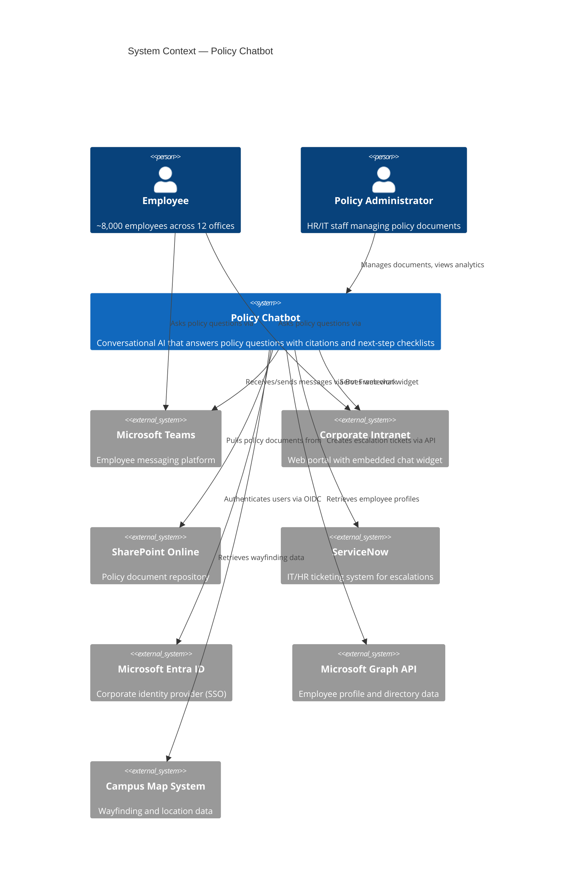
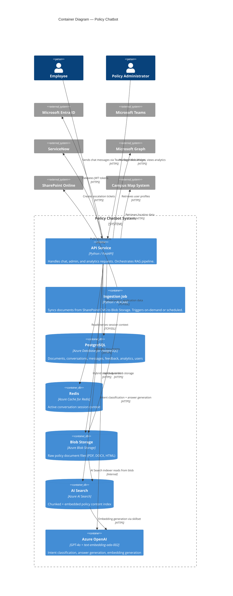
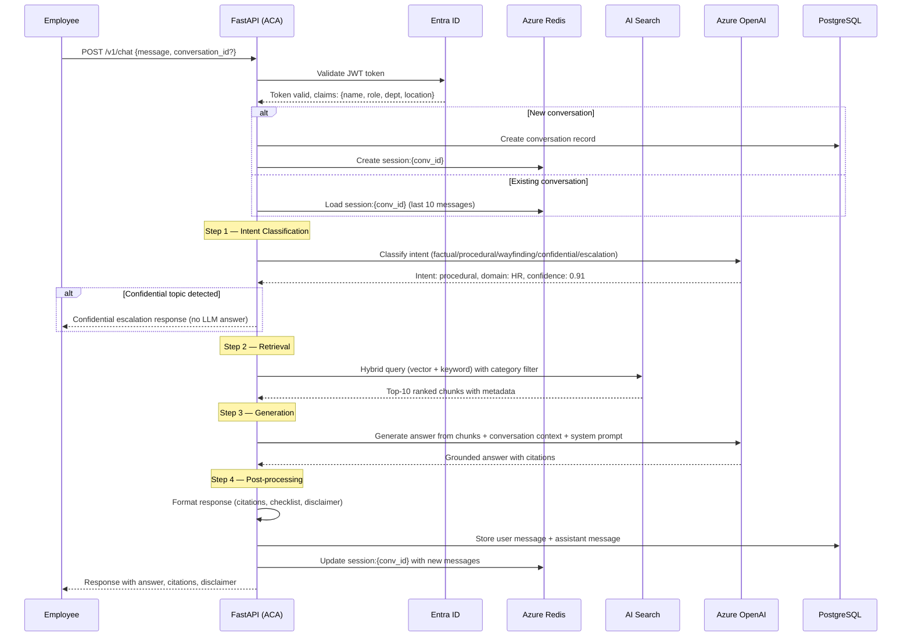
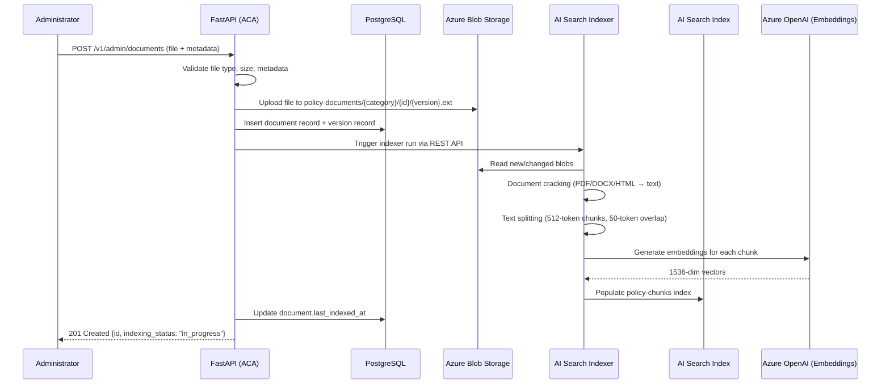

# Architecture Overview: Policy Chatbot

> **Version:** 1.0
> **Date:** 2026-03-20
> **Produced by:** Design Agent
> **Input:** `projects/policy-chatbot/requirements/requirements.md`
> **Related ADRs:** ADR-0007 through ADR-0012

---

## 1. System Context Diagram (C4 Level 1)

Shows the Policy Chatbot system in the context of its external actors and
systems.



---

## 2. Container Diagram (C4 Level 2)

Shows the containers (deployable units) within the Policy Chatbot system.



---

## 3. Component Diagram (C4 Level 3) — API Service

Shows the internal structure of the FastAPI API Service container.

```
┌─────────────────────────────────────────────────────────────────────────┐
│                         FastAPI API Service                             │
│                                                                         │
│  ┌─────────────────────┐   ┌─────────────────────┐                     │
│  │   Auth Middleware    │   │  OpenTelemetry       │                     │
│  │  (JWT validation,   │   │  Middleware           │                     │
│  │   role extraction)  │   │  (traces, metrics)    │                     │
│  └────────┬────────────┘   └─────────────────────┘                     │
│           │                                                              │
│  ┌────────▼────────────────────────────────────────────────────────┐    │
│  │                        API Routers                               │    │
│  │                                                                  │    │
│  │  ┌──────────┐  ┌──────────────┐  ┌───────────┐  ┌───────────┐  │    │
│  │  │ Chat     │  │ Admin        │  │ Analytics │  │ Health    │  │    │
│  │  │ Router   │  │ Router       │  │ Router    │  │ Router    │  │    │
│  │  │          │  │              │  │           │  │           │  │    │
│  │  │ POST     │  │ CRUD         │  │ GET       │  │ GET       │  │    │
│  │  │ /chat    │  │ /documents   │  │ /summary  │  │ /health   │  │    │
│  │  │ POST     │  │ POST         │  │ GET       │  │ GET       │  │    │
│  │  │ /escalate│  │ /reindex     │  │ /intents  │  │ /ready    │  │    │
│  │  │ GET      │  │ POST         │  │ GET       │  │           │  │    │
│  │  │ /convo   │  │ /test-query  │  │ /unans.   │  │           │  │    │
│  │  │ POST     │  │ GET          │  │ GET       │  │           │  │    │
│  │  │ /feedback│  │ /coverage    │  │ /flagged  │  │           │  │    │
│  │  └────┬─────┘  └──────┬──────┘  └─────┬─────┘  └───────────┘  │    │
│  └───────┼───────────────┼────────────────┼────────────────────────┘    │
│          │               │                │                              │
│  ┌───────▼───────────────▼────────────────▼────────────────────────┐    │
│  │                      Service Layer                               │    │
│  │                                                                  │    │
│  │  ┌──────────────────┐  ┌──────────────────┐  ┌──────────────┐  │    │
│  │  │ ChatService      │  │ DocumentService  │  │ Analytics    │  │    │
│  │  │                  │  │                  │  │ Service      │  │    │
│  │  │ - orchestrate()  │  │ - upload()       │  │              │  │    │
│  │  │ - classify_intent│  │ - reindex()      │  │ - summary()  │  │    │
│  │  │ - retrieve()     │  │ - retire()       │  │ - intents()  │  │    │
│  │  │ - generate()     │  │ - get_versions() │  │ - unanswered │  │    │
│  │  │ - format_answer()│  │ - test_query()   │  │ - flagged()  │  │    │
│  │  │ - escalate()     │  │ - coverage()     │  │              │  │    │
│  │  └──────┬───────────┘  └────────┬─────────┘  └──────┬───────┘  │    │
│  └─────────┼───────────────────────┼───────────────────┼───────────┘    │
│            │                       │                   │                  │
│  ┌─────────▼───────────────────────▼───────────────────▼───────────┐    │
│  │                      Integration Clients                         │    │
│  │                                                                  │    │
│  │  ┌────────────┐ ┌────────────┐ ┌──────────┐ ┌──────────────┐   │    │
│  │  │ OpenAI     │ │ AI Search  │ │ Blob     │ │ ServiceNow   │   │    │
│  │  │ Client     │ │ Client     │ │ Client   │ │ Client       │   │    │
│  │  └────────────┘ └────────────┘ └──────────┘ └──────────────┘   │    │
│  │  ┌────────────┐ ┌────────────┐ ┌──────────┐                    │    │
│  │  │ PostgreSQL │ │ Redis      │ │ Graph    │                    │    │
│  │  │ Client     │ │ Client     │ │ Client   │                    │    │
│  │  └────────────┘ └────────────┘ └──────────┘                    │    │
│  └──────────────────────────────────────────────────────────────────┘    │
│                                                                         │
└─────────────────────────────────────────────────────────────────────────┘
```

---

## 4. Deployment Diagram

Shows how containers map to Azure infrastructure.

```
┌──────────────────────────────────────────────────────────────────────┐
│                     Azure Resource Group: rg-policy-chatbot-dev      │
│                                                                      │
│  ┌────────────────────────────────────────────────────────────────┐  │
│  │             Azure Container Apps Environment                   │  │
│  │                                                                │  │
│  │  ┌──────────────────────┐   ┌────────────────────────────┐    │  │
│  │  │  ACA App:            │   │  ACA Job:                   │    │  │
│  │  │  policy-chatbot-api  │   │  policy-chatbot-ingestion   │    │  │
│  │  │                      │   │                              │    │  │
│  │  │  Image: ACR/         │   │  Image: ACR/                │    │  │
│  │  │   policy-chatbot:    │   │   policy-chatbot-ingestion: │    │  │
│  │  │   latest             │   │   latest                    │    │  │
│  │  │                      │   │                              │    │  │
│  │  │  Replicas: 2–10      │   │  Trigger: manual/cron       │    │  │
│  │  │  Ingress: external   │   │  Execution: single          │    │  │
│  │  │  (HTTPS, port 8000)  │   │                              │    │  │
│  │  │                      │   │                              │    │  │
│  │  │  Scaling:            │   │                              │    │  │
│  │  │   HTTP concurrent    │   │                              │    │  │
│  │  │   requests = 50      │   │                              │    │  │
│  │  └──────────┬───────────┘   └──────────────┬───────────────┘    │  │
│  │             │ Managed Identity              │ Managed Identity   │  │
│  └─────────────┼──────────────────────────────┼────────────────────┘  │
│                │                               │                      │
│  ┌─────────────▼───────────────────────────────▼──────────────────┐  │
│  │                    Azure PaaS Services                          │  │
│  │                                                                 │  │
│  │  ┌─────────────────┐  ┌───────────────┐  ┌─────────────────┐  │  │
│  │  │ Azure Database  │  │ Azure Cache   │  │ Azure Blob      │  │  │
│  │  │ for PostgreSQL  │  │ for Redis     │  │ Storage         │  │  │
│  │  │ Flexible Server │  │               │  │                 │  │  │
│  │  │                 │  │ SKU: Basic C1 │  │ Containers:     │  │  │
│  │  │ SKU: GP 2vCores │  │ 250MB cache   │  │  policy-docs    │  │  │
│  │  │ PG 16           │  │               │  │  extracted-text │  │  │
│  │  └─────────────────┘  └───────────────┘  └─────────────────┘  │  │
│  │                                                                 │  │
│  │  ┌─────────────────┐  ┌───────────────────────────────────┐    │  │
│  │  │ Azure AI Search │  │ Azure OpenAI Service              │    │  │
│  │  │                 │  │                                    │    │  │
│  │  │ SKU: Standard   │  │ Deployments:                      │    │  │
│  │  │ Index:          │  │  gpt-4o (chat completion)         │    │  │
│  │  │  policy-chunks  │  │  text-embedding-ada-002 (embed)   │    │  │
│  │  │                 │  │                                    │    │  │
│  │  │ Indexer:        │  │ Data residency: same region       │    │  │
│  │  │  blob-indexer   │  │ Abuse monitoring: opt-out         │    │  │
│  │  └─────────────────┘  └───────────────────────────────────┘    │  │
│  │                                                                 │  │
│  │  ┌─────────────────┐  ┌───────────────────────────────────┐    │  │
│  │  │ Azure Key Vault │  │ Azure Container Registry (ACR)    │    │  │
│  │  │                 │  │                                    │    │  │
│  │  │ Secrets:        │  │ Repository:                        │    │  │
│  │  │  (Entra ID      │  │  policy-chatbot                   │    │  │
│  │  │   client secret)│  │  policy-chatbot-ingestion          │    │  │
│  │  └─────────────────┘  └───────────────────────────────────┘    │  │
│  │                                                                 │  │
│  │  ┌─────────────────────────────────────────────────────────┐    │  │
│  │  │ Azure Monitor / Application Insights                    │    │  │
│  │  │                                                         │    │  │
│  │  │ - Structured JSON logs from ACA → Log Analytics        │    │  │
│  │  │ - OpenTelemetry traces → Application Insights          │    │  │
│  │  │ - Custom metrics: response latency, token usage,       │    │  │
│  │  │   retrieval recall, confidence scores                   │    │  │
│  │  │ - Alert rules: latency > 5s, error rate > 5%,          │    │  │
│  │  │   LLM availability < 99%                                │    │  │
│  │  └─────────────────────────────────────────────────────────┘    │  │
│  └─────────────────────────────────────────────────────────────────┘  │
│                                                                      │
└──────────────────────────────────────────────────────────────────────┘
```

---

## 5. Request Flow — Chat Query

Sequence of operations when an employee asks a policy question:



---

## 6. Request Flow — Document Upload and Indexing



---

## 7. Security Boundaries

```
┌─────────────────────────────────────────────────────────────────┐
│                      Internet / Corporate Network                │
│                                                                  │
│  Employees ──── Teams / Intranet ──── HTTPS ────┐               │
│  Admins ───── Admin Console ──────── HTTPS ─────┤               │
│                                                  │               │
│  ┌───────────────────────────────────────────────▼────────────┐  │
│  │              Azure Virtual Network (optional)              │  │
│  │                                                            │  │
│  │  ┌──────────────────┐     TLS 1.2+                        │  │
│  │  │  ACA Ingress     │◄══════════════════════               │  │
│  │  │  (public HTTPS)  │                                      │  │
│  │  │  JWT validation  │                                      │  │
│  │  └────────┬─────────┘                                      │  │
│  │           │ Managed Identity (no secrets in code)          │  │
│  │           │                                                 │  │
│  │  ┌────────▼──────────────────────────────────────────────┐ │  │
│  │  │  Azure PaaS Services                                  │ │  │
│  │  │  (PostgreSQL, Redis, Blob, AI Search, OpenAI)         │ │  │
│  │  │                                                        │ │  │
│  │  │  - Private endpoints (recommended for production)      │ │  │
│  │  │  - Managed Identity RBAC — no connection strings       │ │  │
│  │  │  - Encryption at rest (AES-256) on all data stores     │ │  │
│  │  │  - Encryption in transit (TLS 1.2+) on all connections │ │  │
│  │  └────────────────────────────────────────────────────────┘ │  │
│  │                                                            │  │
│  │  ┌────────────────────────────────────────────────────────┐ │  │
│  │  │  Azure Key Vault                                       │ │  │
│  │  │  - Entra ID client secret                              │ │  │
│  │  │  - No secrets in env vars, code, or config             │ │  │
│  │  └────────────────────────────────────────────────────────┘ │  │
│  └────────────────────────────────────────────────────────────┘  │
│                                                                  │
└──────────────────────────────────────────────────────────────────┘
```

**Key security controls:**
- All user access authenticated via Entra ID OIDC (NFR-007)
- RBAC enforced at API layer — Employee vs Admin roles (NFR-010)
- Managed Identity for all service-to-service authentication — zero secrets in code
- TLS 1.2+ on all connections (NFR-011)
- AES-256 encryption at rest on PostgreSQL, Redis, and Blob Storage (NFR-012)
- 90-day data retention with automated purge (NFR-008)
- Employee queries never leave Azure tenant boundary (NFR-009)
- No `allow_origins=["*"]` — CORS origins explicitly listed per enterprise standard

---

## 8. Technology Summary

| Component | Technology | ADR |
|-----------|-----------|-----|
| Language | Python 3.11+ | ADR-0007 |
| Framework | FastAPI | ADR-0007 |
| Compute | Azure Container Apps | ADR-0008 |
| Relational DB | Azure Database for PostgreSQL Flexible Server | ADR-0009 |
| Cache | Azure Cache for Redis | ADR-0009 |
| Object storage | Azure Blob Storage | ADR-0009 |
| Search | Azure AI Search (hybrid: vector + keyword) | ADR-0010 |
| LLM | Azure OpenAI GPT-4o | ADR-0010 |
| Embeddings | Azure OpenAI text-embedding-ada-002 | ADR-0010 |
| Document ingestion | AI Search indexer + blob data source | ADR-0011 |
| Authentication | Microsoft Entra ID (OIDC / OAuth 2.0) | ADR-0012 |
| Observability | OpenTelemetry SDK → Azure Monitor / Application Insights | Enterprise standard |
| IaC | Bicep | Enterprise standard |
| CI/CD | GitHub Actions | Enterprise standard |
| Container registry | Azure Container Registry | Enterprise standard |
| Secrets | Azure Key Vault | Enterprise standard |
