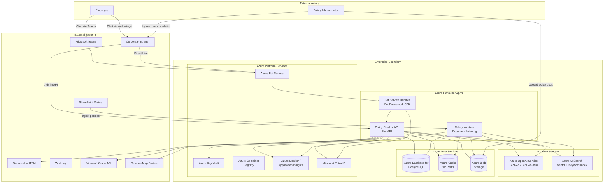
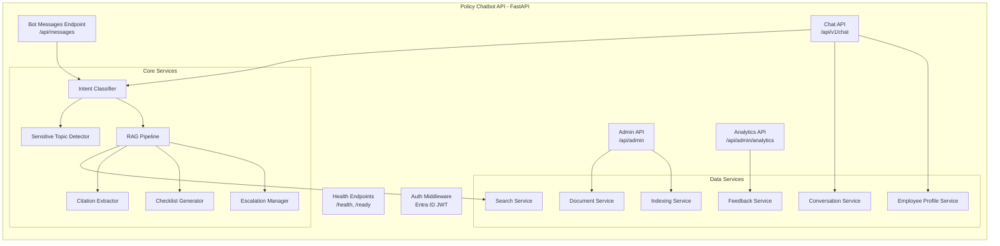
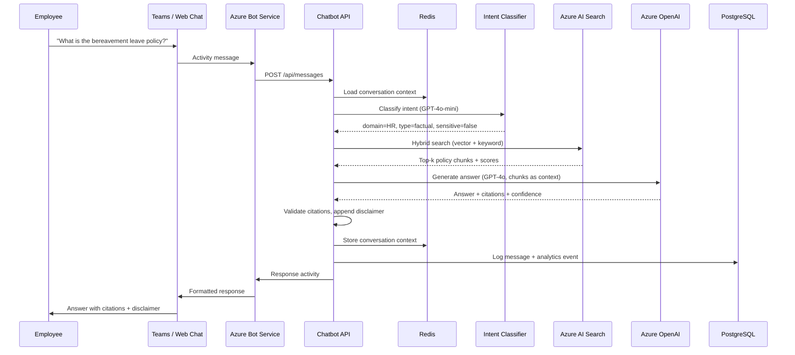
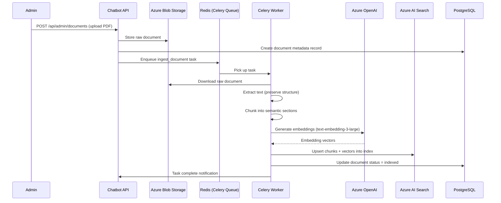
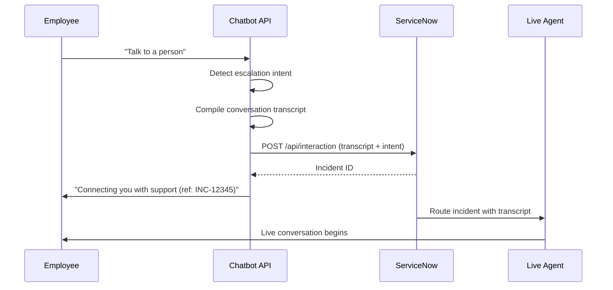

# Architecture Overview: Policy Chatbot

> **Version:** 1.0
> **Date:** 2026-03-17
> **Produced by:** Design Agent
> **Related ADRs:** ADR-0007, ADR-0008, ADR-0009, ADR-0010, ADR-0011

---

## System Context Diagram



---

## Component Diagram



---

## Component Descriptions

### Policy Chatbot API (FastAPI)

The primary application, deployed as an Azure Container App. Handles all HTTP
traffic including Bot Framework messages, REST API requests, and admin console
API calls.

| Component | Purpose | FR Coverage |
|-----------|---------|-------------|
| Bot Messages Endpoint | Receives Teams/web chat messages via Bot Framework | FR-007 |
| Chat API | REST endpoints for direct chat integration | FR-007 |
| Admin API | Document management, test queries, coverage reports | FR-005, FR-031–FR-033 |
| Analytics API | Usage metrics, satisfaction scores, unanswered queries | FR-029, FR-030 |
| Intent Classifier | Determines policy domain and query type | FR-008 |
| Sensitive Topic Detector | Identifies confidential HR queries and blocks AI answers | FR-016 |
| RAG Pipeline | Retrieves policy chunks and generates grounded answers | FR-012–FR-014 |
| Citation Extractor | Extracts and validates source citations from LLM output | FR-013 |
| Checklist Generator | Produces step-by-step checklists for procedural queries | FR-017–FR-021 |
| Escalation Manager | Handles manual and automatic escalation to live agents | FR-025–FR-027 |
| Document Service | CRUD operations for policy documents and metadata | FR-001, FR-004, FR-006 |
| Indexing Service | Triggers document chunking, embedding, and AI Search indexing | FR-002, FR-003, FR-005 |
| Conversation Service | Manages conversation context and history | FR-009, NFR-008 |
| Feedback Service | Records feedback, flags repeated negative feedback | FR-028, FR-030 |
| Employee Profile Service | Retrieves and caches employee profile from Graph API | FR-011 |
| Search Service | Interfaces with Azure AI Search for hybrid retrieval | FR-012 |

### Celery Workers

Background workers deployed as a separate Azure Container App, processing
document indexing tasks asynchronously.

| Task | Purpose | FR Coverage |
|------|---------|-------------|
| `ingest_document` | Parse, chunk, embed, and index a single document | FR-001–FR-003 |
| `reindex_corpus` | Full corpus re-indexing | FR-005, NFR-003 |
| `cleanup_conversations` | Purge conversation logs older than 90 days | NFR-008 |

### Azure Bot Service

Microsoft-managed service that routes messages between Teams/web chat clients and
the chatbot API. Handles protocol translation and channel-specific formatting.

---

## Data Flow Diagrams

### Chat Query Flow



### Document Ingestion Flow



### Escalation Flow



---

## Infrastructure Summary

| Component | Azure Service | SKU / Tier | ADR |
|-----------|---------------|------------|-----|
| Chat API + Admin API | Azure Container Apps | Consumption (autoscale 2–10) | ADR-0008 |
| Celery Workers | Azure Container Apps | Consumption (autoscale 1–5) | ADR-0008 |
| LLM (completions) | Azure OpenAI Service | GPT-4o deployment | ADR-0010 |
| LLM (classification) | Azure OpenAI Service | GPT-4o-mini deployment | ADR-0010 |
| Embeddings | Azure OpenAI Service | text-embedding-3-large | ADR-0010 |
| Vector + keyword search | Azure AI Search | Standard S1 | ADR-0009 |
| Relational database | Azure Database for PostgreSQL | Flexible Server, General Purpose | ADR-0009 |
| Cache + message broker | Azure Cache for Redis | Standard C1 | ADR-0009 |
| Document storage | Azure Blob Storage | Standard LRS | ADR-0009 |
| Bot routing | Azure Bot Service | Standard | ADR-0011 |
| Identity | Microsoft Entra ID | — (existing tenant) | ADR-0011 |
| Secrets | Azure Key Vault | Standard | — |
| Container registry | Azure Container Registry | Basic | — |
| Observability | Azure Monitor + Application Insights | — | — |

---

## Security Boundaries

```
┌─────────────────────────────────────────────────────────────┐
│                    Internet                                  │
│  ┌──────────┐  ┌──────────────┐                             │
│  │ MS Teams │  │ Intranet     │                             │
│  └─────┬────┘  └──────┬───────┘                             │
│        │               │                                     │
├────────┼───────────────┼─────────────────────────────────────┤
│        ▼               ▼         Azure Boundary              │
│  ┌─────────────────────────┐                                 │
│  │  Azure Bot Service      │  (TLS 1.2+, Entra ID auth)    │
│  │  (no public API direct) │                                 │
│  └────────────┬────────────┘                                 │
│               ▼                                              │
│  ┌─────────────────────────┐                                 │
│  │  ACA VNet (internal)    │                                 │
│  │  ┌──────────────────┐   │                                 │
│  │  │ Chatbot API      │   │  Managed Identity auth to:     │
│  │  │ Celery Workers   │   │  - Azure OpenAI                │
│  │  └──────────────────┘   │  - AI Search                   │
│  │                         │  - PostgreSQL                   │
│  │  All data services:     │  - Redis                       │
│  │  private endpoints      │  - Blob Storage                │
│  │  within VNet            │  - Key Vault                   │
│  └─────────────────────────┘                                 │
└─────────────────────────────────────────────────────────────┘
```

- No direct public access to the API — all employee traffic routes through Azure
  Bot Service
- Admin console access via Entra ID-authenticated API endpoints on ACA ingress
  (restricted to corporate network / VPN)
- All Azure service connections use managed identity — no credentials in config
- All data services use private endpoints within the ACA VNet
- Conversation logs encrypted at rest (AES-256) and auto-purged after 90 days
