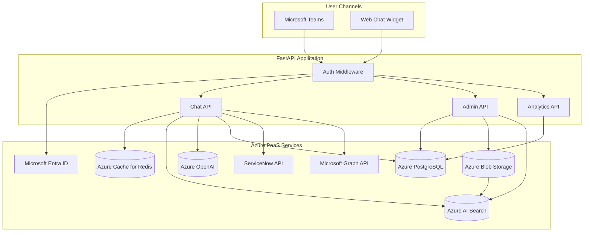

# Data Model: Policy Chatbot

> **Version:** 1.0
> **Date:** 2026-03-20
> **Produced by:** Design Agent
> **Input:** `projects/policy-chatbot/requirements/requirements.md`
> **Related ADRs:** ADR-0009 (data storage), ADR-0010 (RAG architecture), ADR-0011 (document ingestion)

---

## Storage Layer Summary

| Data Category | Storage Service | Purpose |
|---------------|-----------------|---------|
| Relational application data | Azure Database for PostgreSQL | Documents, conversations, messages, feedback, users, analytics |
| Session / conversation context | Azure Cache for Redis | Active conversation state for follow-up resolution |
| Raw document files | Azure Blob Storage | PDF, DOCX, HTML policy documents (versioned) |
| Search index | Azure AI Search | Chunked, embedded policy content for RAG retrieval |

---

## Entity-Relationship Diagram

```mermaid
erDiagram
    USERS {
        uuid id PK
        string email UK "Entra ID UPN"
        string first_name
        string last_name
        string department
        string location
        string role "Employee | Admin"
        string manager_email
        timestamptz created_at
        timestamptz updated_at
    }

    DOCUMENTS {
        uuid id PK
        string title UK
        string category "HR | IT | Finance | Facilities | Legal | Compliance | Safety"
        string status "active | retired"
        date effective_date
        date review_date
        string owner
        string source_url
        int current_version
        int page_count
        timestamptz last_indexed_at
        timestamptz created_at
        timestamptz updated_at
    }

    DOCUMENT_VERSIONS {
        uuid id PK
        uuid document_id FK
        int version_number
        string blob_path "path in Azure Blob Storage"
        string file_type "pdf | docx | html"
        int file_size_bytes
        boolean is_active
        string uploaded_by "admin email"
        timestamptz uploaded_at
    }

    CONVERSATIONS {
        uuid id PK
        uuid user_id FK
        timestamptz started_at
        timestamptz last_message_at
        int message_count
        string status "active | escalated | closed"
        string escalation_ticket_id "ServiceNow ticket ID if escalated"
        timestamptz created_at
    }

    MESSAGES {
        uuid id PK
        uuid conversation_id FK
        string role "user | assistant"
        text content
        jsonb citations "array of citation objects"
        jsonb intent "type, domain, confidence"
        string response_type "answer | checklist | no_match | confidential_escalation | escalation_offer | fallback_search"
        jsonb checklist "checklist items if procedural"
        jsonb wayfinding "wayfinding data if applicable"
        int token_count "total tokens used for this exchange"
        float response_time_ms "latency of LLM response"
        timestamptz created_at
    }

    FEEDBACK {
        uuid id PK
        uuid message_id FK UK
        uuid user_id FK
        string rating "positive | negative"
        text comment
        timestamptz created_at
    }

    FLAGGED_TOPICS {
        uuid id PK
        string topic
        string domain "HR | IT | Finance | etc."
        int negative_count
        jsonb sample_comments "array of strings"
        timestamptz first_flagged_at
        timestamptz updated_at
    }

    ANALYTICS_DAILY {
        uuid id PK
        date date UK
        int total_queries
        int resolved_queries "answered without escalation"
        int escalated_queries
        int no_match_queries
        int positive_feedback_count
        int negative_feedback_count
        float avg_response_time_ms
        timestamptz computed_at
    }

    INTENT_COUNTS {
        uuid id PK
        date date
        string intent_label
        string domain
        int count
    }

    UNANSWERED_QUERIES {
        uuid id PK
        text query_text
        string detected_intent
        string detected_domain
        timestamptz created_at
    }

    USERS ||--o{ CONVERSATIONS : "has"
    CONVERSATIONS ||--o{ MESSAGES : "contains"
    MESSAGES ||--o| FEEDBACK : "receives"
    USERS ||--o{ FEEDBACK : "submits"
    DOCUMENTS ||--o{ DOCUMENT_VERSIONS : "has versions"
```

---

## Entity Descriptions

### USERS

Stores user profiles synced from Microsoft Entra ID on first login. Used for
personalization (FR-011), conversation ownership (NFR-010), and audit trails.

- `email` is the Entra ID UPN (unique across the system)
- `role` is derived from Entra ID app roles (`Employee` or `Admin`)
- `department`, `location`, `manager_email` are populated from Microsoft Graph API
- Profile data is refreshed from Graph on each login

---

### DOCUMENTS

Canonical metadata for each policy document in the corpus. Tracks lifecycle
(active/retired), versioning, and indexing status.

- `category` enables the coverage report (FR-033) and domain-based filtering
- `current_version` references the active `DOCUMENT_VERSIONS` entry
- `last_indexed_at` tracks when the AI Search index was last updated for this document
- `status = retired` removes the document from active search results (FR-031)

---

### DOCUMENT_VERSIONS

Tracks every uploaded version of a document for audit and rollback (FR-006).

- `blob_path` references the file in Azure Blob Storage
  (format: `{category}/{document_id}/{version_number}.{ext}`)
- `is_active` — only one version per document is active at a time
- When a new version is uploaded, the previous version's `is_active` is set to `false`

---

### CONVERSATIONS

Represents a single chat session between a user and the chatbot.

- `status` tracks whether the conversation is active, was escalated to a live
  agent (FR-025), or was closed
- `escalation_ticket_id` stores the ServiceNow incident ID when escalated (FR-026)
- Conversation records are retained for 90 days per NFR-008

---

### MESSAGES

Each message in a conversation — both user messages and assistant responses.

- `role = "user"` for employee messages, `"assistant"` for chatbot responses
- `citations` is a JSONB array of citation objects (document title, section,
  effective date, source URL) — see FR-013
- `intent` captures the classified intent type and confidence (FR-008)
- `response_type` distinguishes answer types for analytics and rendering
- `checklist` is populated for procedural responses (FR-017–FR-020)
- `token_count` and `response_time_ms` support performance monitoring
- Messages are PII — subject to the 90-day retention policy (NFR-008)

---

### FEEDBACK

One feedback entry per assistant message (enforced by unique constraint on
`message_id`).

- `rating` is `positive` or `negative` (FR-028)
- `comment` is optional free text (max 500 chars)
- System monitors negative feedback counts per topic to trigger flagging (FR-030)

---

### FLAGGED_TOPICS

Topics that have received more than 3 negative feedback entries, surfaced for
admin review (FR-030).

- Populated by a background process that aggregates feedback
- `sample_comments` stores up to 5 recent negative feedback comments
- Displayed on the admin analytics dashboard

---

### ANALYTICS_DAILY

Pre-aggregated daily metrics for the analytics dashboard (FR-029). Computed
by a nightly aggregation job (ACA Job on cron schedule).

- Avoids expensive real-time queries against the `messages` table
- `resolved_queries` = queries answered without escalation
- `avg_response_time_ms` tracks performance against the 5-second SLA (NFR-001)

---

### INTENT_COUNTS

Daily intent frequency counts for the "top 20 intents" dashboard view (FR-029).

- Aggregated nightly from `messages.intent`
- Supports time-range filtering on the analytics dashboard

---

### UNANSWERED_QUERIES

Log of queries that received a `no_match` response (FR-029).

- Used by admins to identify content gaps and prioritize document uploads
- Subject to 90-day retention (NFR-008)
- `detected_intent` and `detected_domain` are best-effort classifications
  from the intent classifier

---

## Redis Session Schema

Active conversation context is stored in Redis for low-latency follow-up
resolution (FR-009). Key schema:

```
Key:    session:{conversation_id}
Type:   Hash
TTL:    30 minutes (sliding window — refreshed on each message)

Fields:
  user_id:          uuid
  user_email:       string
  user_first_name:  string
  user_department:  string
  user_location:    string
  messages:         JSON array of last 10 messages (role, content, intent)
  current_domain:   string (last detected policy domain)
  created_at:       ISO timestamp
  last_activity:    ISO timestamp
```

When a follow-up question arrives, the orchestrator loads the session from Redis
to include conversation history in the LLM prompt for context resolution.

---

## Azure AI Search Index Schema

The `policy-chunks` index stores chunked, embedded policy content for RAG
retrieval (see ADR-0010).

```
Index: policy-chunks

Fields:
  chunk_id:         string (key) — "{document_id}_{chunk_index}"
  content:          string (searchable) — chunk text
  content_vector:   Collection(Edm.Single) — 1536-dim embedding
  document_id:      string (filterable)
  document_title:   string (searchable, retrievable)
  section_heading:  string (searchable, retrievable)
  category:         string (filterable, facetable)
  effective_date:   DateTimeOffset (filterable, sortable)
  source_url:       string (retrievable)
  chunk_index:      int (sortable)

Semantic configuration:
  title_field:      document_title
  content_fields:   content
  keyword_fields:   section_heading, category

Vector search configuration:
  algorithm:        HNSW
  dimensions:       1536
  metric:           cosine
```

---

## Data Flow Diagram



---

## Retention and Lifecycle

| Data | Retention | Policy |
|------|-----------|--------|
| Conversations + Messages | 90 days | NFR-008 — purged by nightly cleanup job |
| Feedback | 90 days (raw), aggregated data retained indefinitely | NFR-008 |
| Unanswered queries | 90 days | NFR-008 |
| Analytics daily aggregates | Indefinite | Pre-aggregated, anonymized |
| Document versions | Indefinite | Audit trail for FR-006 |
| Redis sessions | 30-minute TTL | Automatic expiry |
| Blob documents (retired) | Move to Cool tier after 90 days | Cost optimization |
