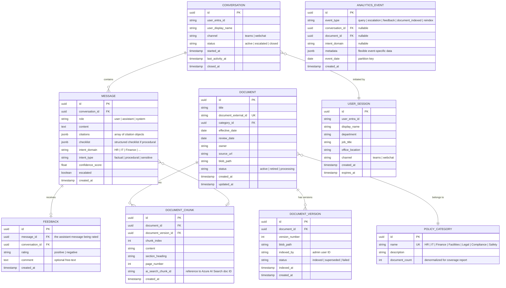
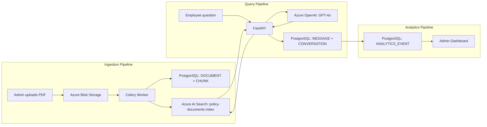

# Data Model: Policy Chatbot

> **Version:** 1.0
> **Date:** 2026-03-17
> **Produced by:** Design Agent
> **Related ADRs:** ADR-0009

---

## Entity Relationship Diagram

---

## Entity Descriptions

### DOCUMENT

Source of truth for policy document metadata. Each document represents a single
policy file (PDF, DOCX, or HTML) uploaded by an administrator or ingested from
SharePoint/intranet.

| Field | Type | Constraints | Notes |
|-------|------|-------------|-------|
| `id` | UUID | PK | Auto-generated |
| `title` | VARCHAR(500) | NOT NULL | Display title |
| `document_external_id` | VARCHAR(255) | UNIQUE, NOT NULL | External reference ID from source system |
| `category_id` | UUID | FK → POLICY_CATEGORY | Policy domain |
| `effective_date` | DATE | NOT NULL | When the policy became effective |
| `review_date` | DATE | NULL | Next scheduled review date |
| `owner` | VARCHAR(255) | NOT NULL | Policy owner (person or team) |
| `source_url` | VARCHAR(2048) | NULL | Link to source in SharePoint/intranet |
| `blob_path` | VARCHAR(1024) | NOT NULL | Azure Blob Storage path to raw file |
| `status` | VARCHAR(20) | NOT NULL, DEFAULT 'processing' | `active`, `retired`, `processing` |
| `created_at` | TIMESTAMPTZ | NOT NULL | Record creation time |
| `updated_at` | TIMESTAMPTZ | NOT NULL | Last update time |

Coverage: FR-004, FR-006, FR-031

### DOCUMENT_VERSION

Tracks each indexed version of a document. When a document is re-uploaded or
re-indexed, a new version record is created. The previous version is marked
`superseded`.

| Field | Type | Constraints | Notes |
|-------|------|-------------|-------|
| `id` | UUID | PK | Auto-generated |
| `document_id` | UUID | FK → DOCUMENT | Parent document |
| `version_number` | INTEGER | NOT NULL | Sequential per document |
| `blob_path` | VARCHAR(1024) | NOT NULL | Blob path for this version's raw file |
| `indexed_by` | VARCHAR(255) | NOT NULL | Entra ID of admin who triggered indexing |
| `status` | VARCHAR(20) | NOT NULL | `indexed`, `superseded`, `failed` |
| `indexed_at` | TIMESTAMPTZ | NULL | When indexing completed |
| `created_at` | TIMESTAMPTZ | NOT NULL | Record creation time |

Coverage: FR-006

### DOCUMENT_CHUNK

Represents a semantically meaningful section extracted from a document version.
Each chunk corresponds to a document in the Azure AI Search index. The actual
vector embedding is stored in AI Search, not PostgreSQL.

| Field | Type | Constraints | Notes |
|-------|------|-------------|-------|
| `id` | UUID | PK | Auto-generated |
| `document_id` | UUID | FK → DOCUMENT | Parent document |
| `document_version_id` | UUID | FK → DOCUMENT_VERSION | Which version this chunk belongs to |
| `chunk_index` | INTEGER | NOT NULL | Order within document |
| `content` | TEXT | NOT NULL | Raw text content of the chunk |
| `section_heading` | VARCHAR(500) | NULL | Heading under which this chunk appears |
| `page_number` | INTEGER | NULL | Source page number (for PDFs) |
| `ai_search_chunk_id` | VARCHAR(255) | NOT NULL, UNIQUE | Corresponding doc ID in Azure AI Search |
| `created_at` | TIMESTAMPTZ | NOT NULL | Record creation time |

Coverage: FR-002, FR-003, FR-013

### POLICY_CATEGORY

Reference table for the 7 policy domains. Used for filtering, analytics, and the
coverage report (FR-033).

Coverage: FR-004, FR-033

### CONVERSATION

Represents a chat session between an employee and the chatbot. A new conversation
is created each time an employee initiates a chat. Conversations are independent
(no cross-session context).

| Field | Type | Constraints | Notes |
|-------|------|-------------|-------|
| `id` | UUID | PK | Auto-generated |
| `user_entra_id` | VARCHAR(255) | NOT NULL | Employee's Entra ID object ID |
| `user_display_name` | VARCHAR(255) | NOT NULL | Cached display name |
| `channel` | VARCHAR(20) | NOT NULL | `teams` or `webchat` |
| `status` | VARCHAR(20) | NOT NULL, DEFAULT 'active' | `active`, `escalated`, `closed` |
| `started_at` | TIMESTAMPTZ | NOT NULL | Session start time |
| `last_activity_at` | TIMESTAMPTZ | NOT NULL | Last message timestamp |
| `closed_at` | TIMESTAMPTZ | NULL | When session ended |

Coverage: FR-009, NFR-008

### MESSAGE

Individual messages within a conversation (both user queries and assistant
responses). Assistant messages store citations, checklists, and confidence scores.

| Field | Type | Constraints | Notes |
|-------|------|-------------|-------|
| `id` | UUID | PK | Auto-generated |
| `conversation_id` | UUID | FK → CONVERSATION | Parent conversation |
| `role` | VARCHAR(20) | NOT NULL | `user`, `assistant`, `system` |
| `content` | TEXT | NOT NULL | Message text |
| `citations` | JSONB | NULL | Array of `{document_title, section, effective_date, source_url}` |
| `checklist` | JSONB | NULL | Structured checklist `{steps: [{text, type, link}]}` |
| `intent_domain` | VARCHAR(50) | NULL | Classified policy domain |
| `intent_type` | VARCHAR(20) | NULL | `factual`, `procedural`, `sensitive` |
| `confidence_score` | FLOAT | NULL | RAG pipeline confidence (0.0–1.0) |
| `escalated` | BOOLEAN | NOT NULL, DEFAULT false | Whether this message triggered escalation |
| `created_at` | TIMESTAMPTZ | NOT NULL | Message timestamp |

Coverage: FR-008, FR-012–FR-014, FR-017, FR-027

### FEEDBACK

Employee feedback on individual assistant responses. Supports the thumbs
up/down mechanism and optional free-text comments.

Coverage: FR-028, FR-030

### USER_SESSION

Cached employee profile data retrieved from Microsoft Graph API. Used for
personalized greetings and role-aware responses. TTL-based expiration.

Coverage: FR-011

### ANALYTICS_EVENT

Generic event log for analytics dashboard metrics. Uses JSONB `metadata` for
flexible event-specific data. Partitioned by `event_date` for efficient querying.

Coverage: FR-029, FR-030

---

## Azure AI Search Index Schema

The vector search index is stored in Azure AI Search, separate from PostgreSQL.
This is the index schema, not a database table.

**Index name:** `policy-documents`

| Field | Type | Searchable | Filterable | Retrievable | Notes |
|-------|------|------------|------------|-------------|-------|
| `chunk_id` | Edm.String | — | ✅ | ✅ | Matches `DOCUMENT_CHUNK.ai_search_chunk_id` |
| `document_id` | Edm.String | — | ✅ | ✅ | FK to PostgreSQL `DOCUMENT.id` |
| `content` | Edm.String | ✅ | — | ✅ | Chunk text (BM25 keyword search) |
| `content_vector` | Collection(Edm.Single) | ✅ (vector) | — | — | Embedding vector (3072 dims) |
| `title` | Edm.String | ✅ | ✅ | ✅ | Document title |
| `section_heading` | Edm.String | ✅ | ✅ | ✅ | Section heading |
| `category` | Edm.String | — | ✅ | ✅ | Policy domain |
| `effective_date` | Edm.DateTimeOffset | — | ✅ | ✅ | Policy effective date |
| `source_url` | Edm.String | — | — | ✅ | Link to source document |
| `page_number` | Edm.Int32 | — | ✅ | ✅ | Source page |

**Vector search configuration:**
- Algorithm: HNSW
- Dimensions: 3072 (text-embedding-3-large)
- Metric: cosine
- Semantic configuration enabled with `content` as primary semantic field

---

## Data Flow Summary

---

## Data Retention & Purging

| Data | Retention | Mechanism | Requirement |
|------|-----------|-----------|-------------|
| Conversation logs + messages | 90 days | Scheduled Celery task purges records older than 90 days | NFR-008 |
| Feedback records | 90 days (linked to messages) | Cascade delete with messages | NFR-008 |
| Analytics events | Indefinite (anonymized/aggregated) | Aggregated events have no PII | NFR-008 |
| Document metadata | Indefinite | Retained for audit and version history | FR-006 |
| Document versions | Indefinite | Retained for audit; old blobs can be archived to cool tier | FR-006 |
| User session cache | 1 hour TTL | Redis TTL expiration | — |
| Conversation context cache | 30 minutes TTL | Redis TTL expiration | — |
