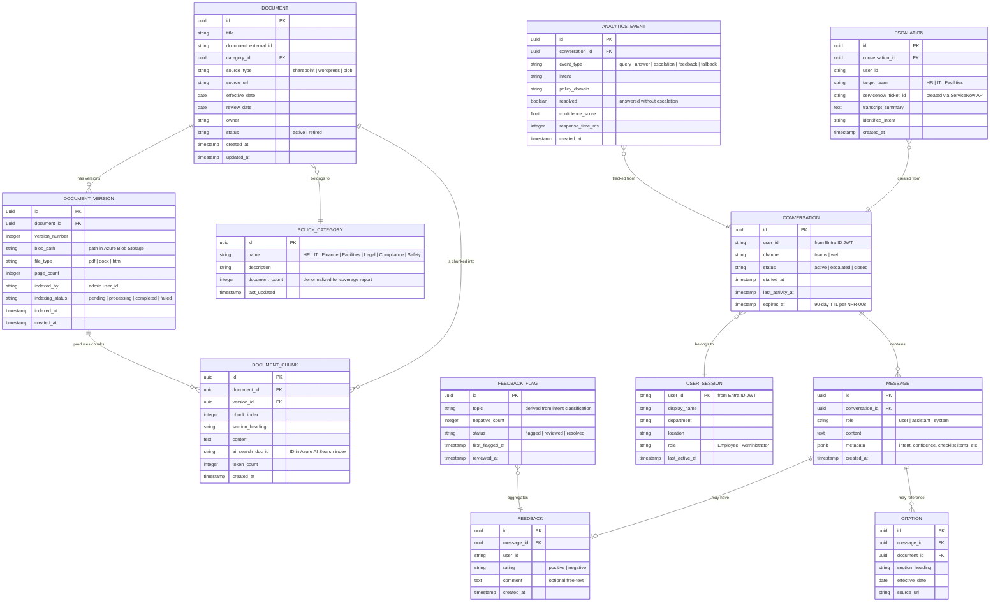
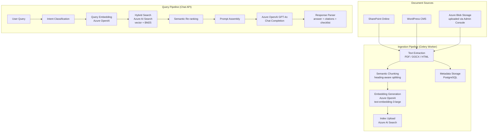

# Data Model: Policy Chatbot

> **Version:** 1.0
> **Date:** 2026-03-16
> **Produced by:** Design Agent
> **Related ADRs:** ADR-0009 (data storage), ADR-0010 (RAG architecture)

---

## 1. Entity Relationship Diagram

---

## 2. Storage Distribution

| Entity | Primary Store | Secondary Store | Rationale |
|--------|--------------|-----------------|-----------|
| `DOCUMENT` | PostgreSQL | — | Relational metadata with versioning |
| `DOCUMENT_VERSION` | PostgreSQL | Azure Blob Storage (raw files) | Metadata in PG, raw files in Blob |
| `DOCUMENT_CHUNK` | PostgreSQL (metadata) | Azure AI Search (content + embeddings) | Chunks indexed for vector search; metadata tracked in PG for lineage |
| `POLICY_CATEGORY` | PostgreSQL | — | Reference data for coverage report (FR-033) |
| `CONVERSATION` | PostgreSQL | Azure Cache for Redis (active session context) | PG for persistence; Redis for fast session lookup (FR-009) |
| `MESSAGE` | PostgreSQL | Redis (recent messages in active session) | PG for history; Redis for conversation context window |
| `CITATION` | PostgreSQL | — | Linked to messages for audit trail |
| `FEEDBACK` | PostgreSQL | — | Persisted for analytics (FR-028, FR-030) |
| `FEEDBACK_FLAG` | PostgreSQL | — | Aggregation for admin review (FR-030) |
| `ESCALATION` | PostgreSQL | — | Audit trail for ServiceNow handoffs |
| `USER_SESSION` | Azure Cache for Redis | — | Cached profile data from Graph API, 24h TTL |
| `ANALYTICS_EVENT` | PostgreSQL | — | Source data for analytics dashboard (FR-029) |

---

## 3. Azure AI Search Index Schema

The AI Search index stores the searchable representation of document chunks.
This is separate from the PostgreSQL metadata.

**Index name:** `policy-chunks-v1`

| Field | Type | Searchable | Filterable | Sortable | Facetable | Retrievable |
|-------|------|-----------|------------|----------|-----------|-------------|
| `id` | `Edm.String` (key) | — | — | — | — | ✅ |
| `document_id` | `Edm.String` | — | ✅ | — | — | ✅ |
| `version_id` | `Edm.String` | — | ✅ | — | — | ✅ |
| `chunk_index` | `Edm.Int32` | — | — | ✅ | — | ✅ |
| `content` | `Edm.String` | ✅ (BM25) | — | — | — | ✅ |
| `section_heading` | `Edm.String` | ✅ | ✅ | — | — | ✅ |
| `document_title` | `Edm.String` | ✅ | ✅ | — | ✅ | ✅ |
| `category` | `Edm.String` | — | ✅ | — | ✅ | ✅ |
| `effective_date` | `Edm.DateTimeOffset` | — | ✅ | ✅ | — | ✅ |
| `source_url` | `Edm.String` | — | — | — | — | ✅ |
| `owner` | `Edm.String` | — | ✅ | — | — | ✅ |
| `content_vector` | `Collection(Edm.Single)` | vector (1536d, cosine) | — | — | — | — |

**Vector search configuration:**
- Algorithm: HNSW
- Dimensions: 1536 (text-embedding-3-large)
- Metric: cosine
- Semantic configuration: enabled with semantic ranker

---

## 4. Redis Data Structures

| Key Pattern | Type | TTL | Purpose |
|-------------|------|-----|---------|
| `session:{user_id}` | Hash | 24h | Cached user profile (name, dept, location, role) |
| `conv:{conversation_id}` | List | 90 days | Recent message history for conversation context window |
| `conv:{conversation_id}:meta` | Hash | 90 days | Conversation metadata (status, channel, identified intent) |
| `rate:{user_id}` | String (counter) | 1 min | Token bucket rate limiter per user |
| `cache:query:{hash}` | String (JSON) | 1 hour | Response cache for identical queries |

---

## 5. Data Retention & Lifecycle

| Data | Retention | Mechanism | Requirement |
|------|-----------|-----------|-------------|
| Conversation logs (messages) | 90 days | PostgreSQL scheduled deletion job | NFR-008 |
| Conversation context (Redis) | 90 days | Redis TTL auto-expiry | NFR-008 |
| Feedback records | 90 days (raw), permanent (aggregated) | PG job aggregates then deletes raw | NFR-008 |
| Analytics events | Permanent (anonymized after 90 days) | PG job strips user_id after 90 days | NFR-008, FR-029 |
| Document metadata | Permanent | — | FR-006 (version history) |
| Document chunks | Active version retained; old versions removed from AI Search | Ingestion worker manages lifecycle | FR-006 |
| Raw document files (Blob) | Permanent (audit trail) | — | FR-006 |
| User session cache (Redis) | 24 hours | Redis TTL auto-expiry | Performance optimization |

---

## 6. Data Flow Diagram

